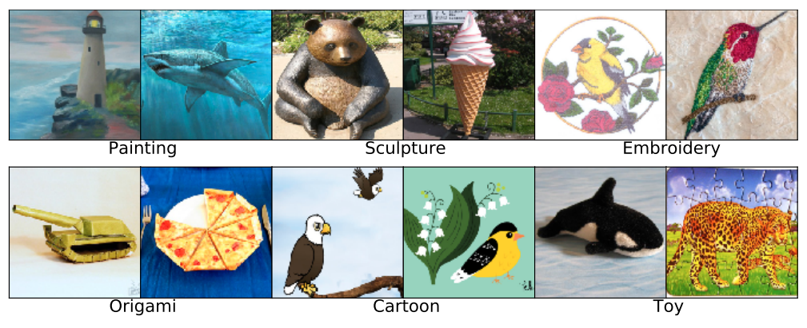

**Contributor(s): Oliver Zhang**

Introduction
============

To illustrate distribution shift robustness, we revisit the previous
chapter’s scenario of a cats-vs-dogs classifier. This time, having
trained and deployed your classifier on an app, let’s say that you only
use the app on genuine cats or dogs. When testing your app, you notice
that somehow, the real-world accuracy is 20%-30% lower than the training
dataset—perhaps your model is overfitting? You retrain your model,
leaving aside some data for validation. Yet somehow the real-world
accuracy is still 20%-30% lower than validation accuracy. This issue,
you realize, isn’t overfitting. Instead, it’s likely that the model is
performing poorly because of a distribution shift between training and
real-world environments.

A distribution shift, or dataset shift, is when the training set and the
testing set are sampled from a different underlying distribution. In
other words, if there are systematic differences between the samples
drawn from the training and testing distribution. Here, ‘testing’ often
refers to data seen in the real-world scenario, after the model has been
deployed in an application. Distribution shifts are one of the largest
problems in preventing widespread adoption of deep learning systems. For
instance, in medicine, practitioners will first train a model on a large
public dataset and then deploy it to a local hospital. However, there
are many differences between the dataset and the local hospital. Some
are deep, like underlying differences in population demographics. Others
are simple, like a difference in brand of imaging equipment, leading to
images of different aspect ratio or resolution.

Similarly, self-driving cars may need to deal with unexpected weather
conditions, like hail or fog, and social media algorithms need to keep
pace with all the new slang being developed. For all of these reasons,
it is crucial to ensure that our models perform well, even when the
distribution shifts.

Problem
=======

More formally, a distribution shift is when the training distribution
does not match the testing distribution:
*P*train(*X*, *Y*) ≠ *P*test(*X*, *Y*). Moreover,
we can further subdivide distribution shifts into a few, non-exhaustive
categories (*Dataset Shift in Machine Learning* 2009). In practice, some
papers adhere to the specific terminology whereas other papers simply
discuss “distribution shift.”

**Label Shift**, also known as prior probability shift, is when
*P*train(*X*|*Y*) = *P*test(*X*|*Y*), but
*P*train(*Y*) ≠ *P*test(*Y*). In other words,
everything remains constant except for the label distributions
*P*train(*Y*) and *P*test(*Y*).

**Covariate Shift** is when
*P*train(*Y*|*X*) = *P*test(*Y*|*X*), but
*P*train(*X*) ≠ *P*test(*X*). In other words,
everything remains constant except for the input distributions
*P*test(*X*) and *P*train(*X*). Most papers in
deep learning which are described as solving “distribution shift” are
actually solving covariate shift. This includes these notes, which will
henceforth focus on covariate shift as well.

Benchmarks
----------

Robustness to distribution shift is usually measured by performance on
robustness benchmarks. Importantly, these benchmarks should only be used
for testing models, not training models. We avoid training models on
these benchmarks to ensure that the distribution shifts are somewhat
representative of unforeseen distribution shifts. With the exception of
WILDS, we focus robustness benchmarks designed to test the robustness of
ImageNet classifiers.

### ImageNet-C

[ImageNet-C](https://paperswithcode.com/sota/domain-generalization-on-imagenet-c)
(Hendrycks and Dietterich 2019), which stands for “ImageNet Corruptions”
is a benchmark created by modifying ImageNet. ImageNet-C applies fifteen
common corruptions to ImageNet at five levels of severity each (for a
total of 75 corruptions). The fifteen corruptions can be seen in figure
<a href="#fig:corruptions" data-reference-type="ref" data-reference="fig:corruptions">1</a>.

Figure 1: Fifteen common corruptions applied to ImageNet.

The most common metric used for ImageNet-C is *mean corruption error* or
mCE. To calculate mCE, divide the average error of your classifier over
all corruptions by the average error of an AlexNet classifier over all
corruptions. For mCE, lower is better. The authors also provide a
corrupted version of the CIFAR-10 and CIFAR-100 datasets for smaller
scale testing. Crucially the authors warn that *networks should not be
trained on ImageNet-C*. Instead, ImageNet-C is meant to act as a
benchmark for a model’s robustness to an unseen dataset shift. We think
that this advice can generalize to most of the benchmarks on this list.

### ImageNet-Sketch and ImageNet-R

[ImageNet-Sketch](https://paperswithcode.com/sota/domain-generalization-on-imagenet-sketch)
(H. Wang et al. 2019) and
[ImageNet-R(enditions)](https://paperswithcode.com/sota/domain-generalization-on-imagenet-r)
(Hendrycks, Basart, et al. 2021) are two similar datasets also loosely
based off of ImageNet. ImageNet-Sketch is a dataset which collected 50K
new sketches of the various ImageNet-1k classes. ImageNet-R is a similar
dataset which collected 30K renditions of various styles of the
ImageNet-1k classes. Note that neither ImageNet-Sketch or ImageNet-R is
a subset of ImageNet. Instead, the images are curated from new images
scraped off of the internet. Examples of each dataset are shown in
figure
<a href="#fig:renditions" data-reference-type="ref" data-reference="fig:renditions">3</a>.

Figure 2: Example images from ImageNet-Sketch (top) and ImageNet-R (bottom).

These two datasets are designed to benchmark a model’s robustness to a
significant, yet still controlled, distribution shift. In particular,
these datasets test whether a model can generalize from a dataset
composed of largely real-world images to datasets consisting of sketches
or other artistic renditions. This is a difficult task and, if achieved,
provides strong evidence for a model’s robustness to distribution
shifts.

### ImageNet-A

[ImageNet-A](https://paperswithcode.com/sota/domain-generalization-on-imagenet-a)
(Hendrycks, Zhao, et al. 2021) is a collection of images belonging to
ImageNet classes, which have been adversarially filtered to be difficult
for models to classify. Specifically, a large set of images are tested
on two different ResNets, and only images which the ResNets both perform
poorly on are included. In total, the dataset contains images spanning
200 ImageNet-1k classes. Similar to ImageNet-Sketch and ImageNet-R,
ImageNet-A is also not a subset of ImageNet, but is curated from a
separately collected set of images. Examples from ImageNet-A can be
found in figure
<a href="#fig:adversarial" data-reference-type="ref" data-reference="fig:adversarial">4</a>.

Figure 3: Example images from ImageNet-A.

### WILDS

Finally, [WILDS](https://wilds.stanford.edu/) (Koh et al. 2021; Sagawa
et al. 2021) is a collection of ten datasets which document in-the-wild
distribution shifts. These datasets consider distribution shift on
different modalities (e.g., language, code, or molecule graphs) and in
different fields (e.g., medicine, satellite pictures, Amazon reviews).
In contrast with the previous benchmarks, the datasets in WILDS are
unconstrained and more representative of real-world distribution shift
scenarios. This means that WILDS is a good stress-test of distribution
shift robustness algorithms. Furthermore, beyond the traditional
(*x*, *y*) pairs, WILDS provides an additional label *d* which tells the
domain of the example. The precise definition of a ‘domain’ is
task-specific, but represents a sub-distribution (e.g., all the images
from a given camera) within the larger distribution. For a visualization
of images in WILDS, see figure
<a href="#fig:wilds" data-reference-type="ref" data-reference="fig:wilds">5</a>.

<
Figure 4: The ten different datasets in WILDS.

Approaches
==========

Improving the robustness of ImageNet classifiers largely breaks down
into three directions: data augmentation, architectural choices, and
pretraining techniques.

Data Augmentation
-----------------

Data augmentation is the process of applying randomized transformations
(e.g., horizontal flip, rotation within 30 degrees, discoloration) on
input examples to create additional valid data. Data augmentation
improves robustness by increasing the diversity of a dataset to include
perturbed or altered images. If a model learns features robust to the
data augmentation, the hope is that the same features will be robust to
test-time distribution shift as well. It is important to know that in
the research setting, researchers must avoid training on the exact
corruptions in the testing set, else they begin to overfit on a specific
set of corruptions.

Directions in data augmentation include directly proposing new
augmentations (Zhang et al. 2018; Geirhos et al. 2019; Hendrycks,
Basart, et al. 2021; Hendrycks, Zou, et al. 2021), developing algorithms
which find the best augmentations for any given dataset (Cubuk, Zoph,
Mane, et al. 2019; Cubuk, Zoph, Shlens, et al. 2019), or composing
multiple augmentations to further increase augmentation strength
(Hendrycks et al. 2020; Hendrycks, Zou, et al. 2021). Finally, recent
work has demonstrated that leveraging a specific type of adversarial
data augmentation, named pyramidal adversarial training, drastically
improves robustness (Herrmann et al. 2021). Pyramidal adversarial
training adds adversarial noise at several different resolutions,
leading to an image with multiple layers of adversarial perturbation.
Figure
<a href="#fig:pyramid" data-reference-type="ref" data-reference="fig:pyramid">6</a>
visualizes pyramid adversarial training as well as the performance gains
it brings.

Figure 5: Pyramid adversarial training improves in-distribution performance and out-of-distribution robustness.

Model Architecture
------------------

Improving model architecture also leads to gains in performance.
Currently, there exist two main architecture types in computer vision:
convolutional neural networks and transformers. As a recap, transformers
are a network architecture based heavily on “attention,” a technique for
quickly routing information through a neural network (Vaswani et al.
2017). Transformers were developed for natural language processing and
became widespread there, before being adapted to computer vision
(Dosovitskiy et al. 2021). If this is new, we highly recommend students
read the initial vision transformer paper (Dosovitskiy et al. 2021) or
watch this [summary video](https://www.youtube.com/watch?v=TrdevFK_am4).

After the release of the initial vision transformer (ViT), researchers
quickly demonstrated that vision transformers are more robust than
ResNets (Bhojanapalli et al. 2021; Morrison et al. 2021; Paul and Chen
2021). ViT’s robustness has been attributed to many of its architectural
choices, but it’s generally agreed that its attention mechanism plays a
big role in its robustness. For instance, if you limit a transformer’s
attention to a local context, similar to the convolutional filters in a
ConvNet, robustness decreases (Mao et al. 2021). Further tweaking of the
transformer led to the development of robust vision transformer (RVT).
Overall, it’s difficult to fully summarize RVT, as it’s a collection of
many small tricks which together have a very significant affect on
robustness (Mao et al. 2021).

In the meantime, other researchers began tweaking convolutional networks
as well. Researchers at Facebook released the ConvNeXt architecture (Liu
et al. 2022) which started at a ResNet50 base and systematically
improved the architecture until it was on par with the best vision
transformer systems. Interestingly, although they optimize for ImageNet
validation performance, they get very strong robustness results as a
side effect. Similar to RVT, summarizing ConvNeXt is difficult as it
involves many small tricks which amount to a sizable impact. As it
currently stands, RVT and ConvNeXt have similar performance on
distribution shifts—neither side has established itself as the dominant
architecture for model robustness just yet.

Pretraining Techniques
----------------------

Finally, very recently, researchers have demonstrated that choosing the
right pretraining technique can dramatically improve model robustness. A
paper from facebook titled “Masked Autoencoders are Scalable Vision
Learners” proposed a novel pretraining technique involving masking out
large portions of the image and trying to reconstruct them. Although
this core idea is nothing new (Vincent et al. 2008; Devlin et al. 2019),
the proposed masked autoencoder (MAE) incorporates several tricks to
reach state of the art. First, MAE divides an image into patches and
randomly masks out a large (around 80%) proportion of them. In practice,
aggressive masking is required, or else a model will only learn to
interpolate between patches rather than learn global representations of
the image. See figure
<a href="#fig:mae" data-reference-type="ref" data-reference="fig:mae">7</a>
for an example of a masked image. Second, MAE leverages vision
transformers rather than convolutional networks. ConvNets are a bad
choice here because each neuron has a limited receptive field, and as we
previously discussed, local techniques like interpolation fail due to
the aggressive masking. In contrast, vision transformers are designed to
for global information aggregation and can deal with the aggressive
masking better.

Finally, MAE leverages a two-step autoencoding process for scalability.
First, it uses a deep encoder to process only the non-masked patches. By
only processing the patches which provide information, the encoder only
needs to focus on 20% of the image. This, in turns, enables the encoder
to scale to deeper architectures. Second, it uses a shallow decoder to
reconstruct the whole image. This time, the decoder inputs both the
encoded vectors of the non-masked patches as well as vectors for the
masked patches. However, since the decoder is much more shallow than the
encoder, processing the full image ends up not being a large
computational burden as well. Figure
<a href="#fig:mae" data-reference-type="ref" data-reference="fig:mae">7</a>
gives a full visualization of the architecture.

Figure 6: MAE leverages three tricks: aggressive masking, vision transformers, and a two-part architecture for scalability. The encoder is a larger network which only processes the non-masked patches. The decoder is shallower and processes all patches, masked and non-masked. Since the encoder already has deeply processed the non-masked patches, the decoder can focus on reconstructing the image.

When it was released, MAE quickly set state of the art for many
robustness benchmarks, including ImageNet-C, ImageNet-Sketch,
ImageNet-R, and ImageNet-A. This is attributed to two facts. First, MAE
is able to scale better than other vision models, providing strong
representations as model size increases. Second, MAE’s pretraining
technique is inherently robust, outperforming a supervised baseline by
large margins when controlling for scale.

Other Frameworks
================

It is worth mentioning that there exists a lot of other work beyond the
benchmarks and methods discussed in this set of notes. One prominent
direction which has not been discussed yet involves learning features
which are invariant to distribution shift (Arjovsky et al. 2020; Shi et
al. 2021; Sun and Saenko 2016). Specifically, this direction argues that
not all correlations within the training data are valid. Instead, some
correlations are spurious correlations which should be ignored by the
network. For instance, a bird classification dataset may have have a
correlation between being a waterbird and having a blue background
(Sagawa et al. 2020). However, such a correlation should be ignored by
the network, as the feature ‘has a blue background’ may not predict
being a waterbird upon distribution shift. In other words, that features
is not invariant to distribution shift. Work in this direction involve
training auxiliary objectives to enforce feature invariance on multiple
different domains (Arjovsky et al. 2020; Shi et al. 2021; Sun and Saenko
2016).

Other prominent work explores how to optimize over an explicit set of
different distributions (Sagawa et al. 2020; Subbaswamy, Adams, and
Saria 2021). Specifically, given knowledge of the different
distributions within a dataset, this direction attempts to leverage this
knowledge in the optimization algorithm. Such directions are especially
relevant in the context of algorithmic bias and racial inequality
(Buolamwini and Gebru 2018). Finally, other work also explores
robustness to label shift (Lipton, Wang, and Smola 2018) or learning to
adapt to a new testing distribution (D. Wang et al. 2021).

Conclusion
==========

In this chapter, we provide an exploration of one direction in
distribution shift robustness. We first survey a variety of benchmarks
based around ImageNet style classification. We then reviewed three areas
to improve robustness: data augmentation, model architecture, and
pretraining techniques. Finally, we provided a preliminary survey of
other directions in distribution shift robustness.

References
==========

Arjovsky, Martin, Léon Bottou, Ishaan Gulrajani, and David Lopez-Paz.
2020. “Invariant Risk Minimization.” <http://arxiv.org/abs/1907.02893>.

Bhojanapalli, Srinadh, Ayan Chakrabarti, Daniel Glasner, Daliang Li,
Thomas Unterthiner, and Andreas Veit. 2021. “Understanding Robustness of
Transformers for Image Classification.”
<http://arxiv.org/abs/2103.14586>.

Buolamwini, Joy, and Timnit Gebru. 2018. “Gender Shades: Intersectional
Accuracy Disparities in Commercial Gender Classification.” In
*Proceedings of the 1st Conference on Fairness, Accountability and
Transparency*, edited by Sorelle A. Friedler and Christo Wilson,
81:77–91. Proceedings of Machine Learning Research. PMLR.
<https://proceedings.mlr.press/v81/buolamwini18a.html>.

Cubuk, Ekin D., Barret Zoph, Dandelion Mane, Vijay Vasudevan, and Quoc
V. Le. 2019. “AutoAugment: Learning Augmentation Policies from Data.”
<http://arxiv.org/abs/1805.09501>.

Cubuk, Ekin D., Barret Zoph, Jonathon Shlens, and Quoc V. Le. 2019.
“RandAugment: Practical Automated Data Augmentation with a Reduced
Search Space.” <http://arxiv.org/abs/1909.13719>.

*Dataset Shift in Machine Learning*. 2009. Neural Information Processing
Series. MIT Press.

Devlin, Jacob, Ming-Wei Chang, Kenton Lee, and Kristina Toutanova. 2019.
“BERT: Pre-Training of Deep Bidirectional Transformers for Language
Understanding.” <http://arxiv.org/abs/1810.04805>.

Dosovitskiy, Alexey, Lucas Beyer, Alexander Kolesnikov, Dirk
Weissenborn, Xiaohua Zhai, Thomas Unterthiner, Mostafa Dehghani, et al.
2021. “An Image Is Worth 16x16 Words: Transformers for Image Recognition
at Scale.” <http://arxiv.org/abs/2010.11929>.

Geirhos, Robert, Patricia Rubisch, Claudio Michaelis, Matthias Bethge,
Felix A. Wichmann, and Wieland Brendel. 2019. “ImageNet-Trained CNNs Are
Biased Towards Texture; Increasing Shape Bias Improves Accuracy and
Robustness.” <http://arxiv.org/abs/1811.12231>.

Hendrycks, Dan, Steven Basart, Norman Mu, Saurav Kadavath, Frank Wang,
Evan Dorundo, Rahul Desai, et al. 2021. “The Many Faces of Robustness: A
Critical Analysis of Out-of-Distribution Generalization.”
<http://arxiv.org/abs/2006.16241>.

Hendrycks, Dan, and Thomas Dietterich. 2019. “Benchmarking Neural
Network Robustness to Common Corruptions and Perturbations.”
<http://arxiv.org/abs/1903.12261>.

Hendrycks, Dan, Norman Mu, Ekin D. Cubuk, Barret Zoph, Justin Gilmer,
and Balaji Lakshminarayanan. 2020. “AugMix: A Simple Data Processing
Method to Improve Robustness and Uncertainty.”
<http://arxiv.org/abs/1912.02781>.

Hendrycks, Dan, Kevin Zhao, Steven Basart, Jacob Steinhardt, and Dawn
Song. 2021. “Natural Adversarial Examples.”
<http://arxiv.org/abs/1907.07174>.

Hendrycks, Dan, Andy Zou, Mantas Mazeika, Leonard Tang, Bo Li, Dawn
Song, and Jacob Steinhardt. 2021. “PixMix: Dreamlike Pictures
Comprehensively Improve Safety Measures.”
<http://arxiv.org/abs/2112.05135>.

Herrmann, Charles, Kyle Sargent, Lu Jiang, Ramin Zabih, Huiwen Chang, Ce
Liu, Dilip Krishnan, and Deqing Sun. 2021. “Pyramid Adversarial Training
Improves ViT Performance.” <http://arxiv.org/abs/2111.15121>.

Koh, Pang Wei, Shiori Sagawa, Henrik Marklund, Sang Michael Xie, Marvin
Zhang, Akshay Balsubramani, Weihua Hu, et al. 2021. “WILDS: A Benchmark
of in-the-Wild Distribution Shifts.” <http://arxiv.org/abs/2012.07421>.

Lipton, Zachary C., Yu-Xiang Wang, and Alex Smola. 2018. “Detecting and
Correcting for Label Shift with Black Box Predictors.”
<http://arxiv.org/abs/1802.03916>.

Liu, Zhuang, Hanzi Mao, Chao-Yuan Wu, Christoph Feichtenhofer, Trevor
Darrell, and Saining Xie. 2022. “A ConvNet for the 2020s.”
<http://arxiv.org/abs/2201.03545>.

Mao, Xiaofeng, Gege Qi, Yuefeng Chen, Xiaodan Li, Ranjie Duan, Shaokai
Ye, Yuan He, and Hui Xue. 2021. “Towards Robust Vision Transformer.”
<http://arxiv.org/abs/2105.07926>.

Morrison, Katelyn, Benjamin Gilby, Colton Lipchak, Adam Mattioli, and
Adriana Kovashka. 2021. “Exploring Corruption Robustness: Inductive
Biases in Vision Transformers and MLP-Mixers.”
<http://arxiv.org/abs/2106.13122>.

Paul, Sayak, and Pin-Yu Chen. 2021. “Vision Transformers Are Robust
Learners.” <http://arxiv.org/abs/2105.07581>.

Sagawa, Shiori, Pang Wei Koh, Tatsunori B. Hashimoto, and Percy Liang.
2020. “Distributionally Robust Neural Networks for Group Shifts: On the
Importance of Regularization for Worst-Case Generalization.”
<http://arxiv.org/abs/1911.08731>.

Sagawa, Shiori, Pang Wei Koh, Tony Lee, Irena Gao, Sang Michael Xie,
Kendrick Shen, Ananya Kumar, et al. 2021. “Extending the WILDS Benchmark
for Unsupervised Adaptation.” <http://arxiv.org/abs/2112.05090>.

Shi, Yuge, Jeffrey Seely, Philip H. S. Torr, N. Siddharth, Awni Hannun,
Nicolas Usunier, and Gabriel Synnaeve. 2021. “Gradient Matching for
Domain Generalization.” <http://arxiv.org/abs/2104.09937>.

Subbaswamy, Adarsh, Roy Adams, and Suchi Saria. 2021. “Evaluating Model
Robustness and Stability to Dataset Shift.”
<http://arxiv.org/abs/2010.15100>.

Sun, Baochen, and Kate Saenko. 2016. “Deep CORAL: Correlation Alignment
for Deep Domain Adaptation.” <http://arxiv.org/abs/1607.01719>.

Vaswani, Ashish, Noam Shazeer, Niki Parmar, Jakob Uszkoreit, Llion
Jones, Aidan N. Gomez, Lukasz Kaiser, and Illia Polosukhin. 2017.
“Attention Is All You Need.” <http://arxiv.org/abs/1706.03762>.

Vincent, Pascal, Hugo Larochelle, Yoshua Bengio, and Pierre-Antoine
Manzagol. 2008. “Extracting and Composing Robust Features with Denoising
Autoencoders.” In *Proceedings of the 25th International Conference on
Machine Learning - ICML ’08*, 1096–1103. ACM Press.
<https://doi.org/10.1145/1390156.1390294>.

Wang, Dequan, Evan Shelhamer, Shaoteng Liu, Bruno Olshausen, and Trevor
Darrell. 2021. “Tent: Fully Test-Time Adaptation by Entropy
Minimization.” <http://arxiv.org/abs/2006.10726>.

Wang, Haohan, Songwei Ge, Zachary Lipton, and Eric P Xing. 2019.
“Learning Robust Global Representations by Penalizing Local Predictive
Power.” In *Advances in Neural Information Processing Systems*, edited
by H. Wallach, H. Larochelle, A. Beygelzimer, F. dAlché-Buc, E. Fox, and
R. Garnett. Vol. 32. Curran Associates, Inc.
<https://proceedings.neurips.cc/paper/2019/file/3eefceb8087e964f89c2d59e8a249915-Paper.pdf>.

Zhang, Hongyi, Moustapha Cisse, Yann N. Dauphin, and David Lopez-Paz.
2018. “Mixup: Beyond Empirical Risk Minimization.”
<http://arxiv.org/abs/1710.09412>.
