# Cooperative AI
**Contributor(s): Bilal Chughtai**

Cooperative AI is an emerging research area even within safety. As such, this lecture focuses on motivation and background concepts. These written notes go further, presenting promising future directions and representative examples of work in them.

# Motivation

Problems of cooperation — in which agents have opportunities to improve their joint utility, but are not easily able to do so — are ubiquitous and important. Mundane day to day examples include driving and meeting scheduling, but the need for cooperation scales all the way up to many of the *world's most pressing problems*. Examples include

* Climate change is a problem where everyone contributes, but rational entities may not be incentivised to take action. Coordination is required so that everyone may equally share the burden of action.
* War is a problem where actors need to coordinate to prevent risks of escalation, which would result in a worse outcome for all parties. 
* Curtailing the spread of a deadly pandemic requires the coordination of every individual in a society.

Equally, cooperation is in no small part responsible for human civilization and the success of the human species. Some of our *greatest successes* can be attributed to cooperation
* Trade allows society to progress past agricultural society, through allowing for highly specialised workers. This significantly increased economic productivity.
* Modern economies of scale require a high degree of cooperation between different industry and are integral to today's society.
  
As our societies, economies, and militaries become ever more powerful and connected, the need for cooperation becomes greater. Advanced AI will only exarcerbate existing cooperation problems through increasing power and interconnectedness of actors further. We've seen examples of AI induced cooperation failures already - the 2010 flash crash was a trillion dollar market crash caused by errors with artificial intelligence powered automated trading systems (though a consensus on the precise reasons has still not been reached).

<figcaption aria-hidden="true"><i>Figure 1: The 2010 Flash Crash</i></figcaption>

Cooperative AI seeks to reverse these problems. It asks *how can we use advances in AI to help us solve cooperation problems?* Prior work in AI safety has focussed primarily on the single-single paradigm, in which a single human interacts with a single AI agent. This seems insufficient - it seems likely that in future we will need to foster cooperation between between complex systems of humans, machines and institutions of both. Cooperative AI improves AI safety through reducing risks from cooperation failures. 

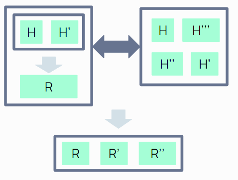<figcaption aria-hidden="true"><i>Figure 1: Complex future institutions of humans (H) and robots (R) cooperating. Image credit Lewis Hammond. </i></figcaption>

# Mathematical Preliminaries

We first require a mathematical framework to think about cooperation. **Game theory** is the study of mathematical models of strategic interactions among rational agents, and encompasses a large range of possible cooperation problems.

**Definition:** A *game* is a triplet $\mathcal{G} = \left(I, (S_i)_{i\in I}, (h_i)_{i\in I}\right)$, where

1. $I$ is the set of players $I=\{1,...,n\}$
2. For each $i\in I$, $S_i$ is player $i$'s set of strategies, let $S=\prod_i S_i$
3. For each $i\in I$, $h_i: S\rightarrow \mathbb{R}$ is a function mapping overall strategies to payoffs. One can decompose this into a function $g: S\rightarrow A$ from strategies to outcomes in some outcome space $A$, and then utiltity functions $u_i: A \rightarrow \mathbb{R}$ mapping outcomes to real numbers. Then $\forall s\in S$, $h_i(s) = u_i (g(s))$.

In words, a game defines a set of possible strategies and payoffs for each agent.

## Non Cooperative Games

**Example 1:** *The Prisoner's Dilemma*. Suppose two members of a criminal gang are arrested and imprisoned. Each prisoner is in solitary confinement with no means of speaking to or exchanging messages with the other. The police admit they don't have enough evidence to convict the pair on the principal charge. They plan to sentence both to a year in prison on a lesser charge. Simultaneously, the police offer each prisoner a Faustian bargain. The possible outcomes are:
* If A and B each betray the other, each of them serves two years in prison
* If A betrays B but B remains silent, A will be set free and B will serve three years in prison
* If A remains silent but B betrays A, A will serve three years in prison and B will be set free
* If A and B both remain silent, both of them will serve one year in prison (on the lesser charge).

These can be represented in a **payoff matrix**.

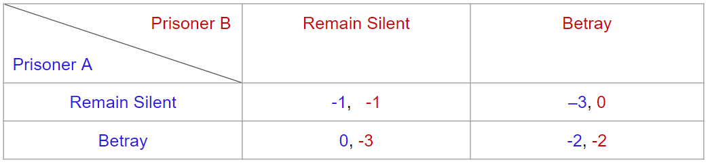<figcaption aria-hidden="true"><i>Figure 1: Payoff matrix for the Prisoner's dilemma. </i></figcaption>

We see betraying a partner offers greater reward than cooperating with them, so all purely rational self-interested prisoners will betray the other, despite mutual cooperation yielding a greater reward. 

**Definition:** A *Nash equilibrium* is a collection $(s_i)_{i\in I}$ of stategy profiles for each player, with $s_i \in S_i$, such that no agent can benefit by unilaterally deviating.

That is, if Alice and Bob choose strategy A and B respectively, (A, B) is a Nash equilibrium if and only if Alice has no other strategy available that does better than A at maximizing her payoff in response to Bob choosing B, and Bob has no other strategy available that does better than B at maximizing his payoff in response to Alice choosing A. In a game in which Carol and Dan are also players, (A, B, C, D) is a Nash equilibrium if and only if A is Alice's best response to (B, C, D), B is Bob's best response to (A, C, D), and so forth.

Given finite games, one can prove at least one Nash equilibrium always exists. These provide the most commonly used definition of a solution to a non cooperative game.

**Definition:** A *dominant strategy* is a strategy that is better than any other strategy for one player, no matter how that player's opponents may play. It follows that if a strictly dominant strategy exists for one player in a game, that player will play that strategy in each of the game's Nash equilibria.

**Example 1:** We see for the Prisoner's dilemma betray is a dominant strategy for both players (as the game is *symettric*), and so (betray, betray) is the Nash equilibirum. 

**Example 2:* *Stag Hunt* Let us consider one more example of a non-cooperative game. In this game, there are two hunters. There are two rabbits and one stag in the hunting range. Before leaving to go hunt, each hunter can only take equipment that catches one type of animal. The stag has more meat than the two rabbits combined, but the hunters have to cooperate with each other to catch it, while the hunter that catches rabbits can catch all the rabbits. The payoff matrix is as follows:

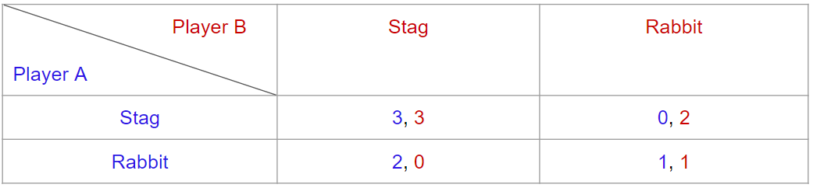<figcaption aria-hidden="true"><i>Figure 2: Payoff matrix for Stag hunt. </i></figcaption>

Here, there is no dominant strategy, and both diagonal entries are Nash equilibria. If hunter A knows that hunter B is going to catch stag, then hunter A should also take equipment to catch the stag. If hunter A knows that hunter B is going to catch the rabbits, then that hunter should go to catch a rabbit too! Once again, self interested agents do not necessarily achieve the optimal outcome, so cooperation is important.

**Definition:** A game is said to be *zero-sum* if the total of gains and losses sum to zero, and thus one player benefits at the direct expense at others. 

**Examples:**
* College admissions. The number of recruited students is fixed, so if some student is successfully recruited, some other student is not.
* Chess, tennis, or generally any game where there is one loser and one winner are zero sum.

**Definition:** A game is said to be *positive-sum* if the total of gains and losses is greater than zero. Intuitively, this occurs when resources are somehow increased and there exist approaches, possibly requiring coordination, where desires and needs of all players are satisfied.

**Examples:**
* Trade of goods and services between businesses or nations brings mutually beneficial gains. Both parties benefit from the further specialisation.

**Definition:** The outcome of a game is *Pareto-efficient* or *Pareto-optimal* if no player's expected payoff $u_i$ can be increased without some other player's expected payoff $u_j$ decreasing. 

A natural measure of how cooperative some game outcome is is its distance to the *Pareto-frontier*, the set of Pareto-efficient solutions.

**Examples:**
* A zero-sum game has all outcomes being *pareto-optimal*.
* For the prisoners dilemma, we see the mutually non cooperative outcome is far from the Pareto-frontier

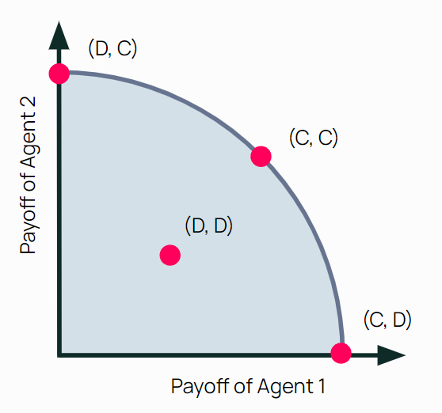<figcaption aria-hidden="true"><i>Figure 2: Pareto effiecency of the Prisoner's dilemma. Image credit Lewis Hammond. </i></figcaption>

To define this distance, one needs some ordering on the space of outcomes. 

**Definition:** A social welfare function is a function that ranks outcomes as less desirable, more desirable, or indifferent for every possible pair of outcomes.

One way of defining this ordering is through a function $w: \mathbb{R}^n \rightarrow \mathbb{R}$ on the space of payoffs. Choosing $w(u_1,...,u_n)=\sum_i u_i$ gives the utilitarian welfare function, where all players are given equal intrinsic moral weight. 

## Other classes of problem 

**Definition:** A *collective action problem*, or *free rider problem*, is a problem where there is a cost to for some player to contribute, but all others receive a benefit.

A model for certain types of collective action problem is as follows. Let $x_j\in\{0,1\}$ be the action of individual $j$, and assume $\beta\in (0,1)$. If 

$$u_j = -x_j + \beta \sum_i x_i$$

is the utility of individual $j$, we see $j$ acting reduces their utility, while increaing the utility of the collective. 

**Examples:**
* Carbon emissions. One is not incentivized to reduce their own emissions, but recieves benefit if others do so.

**Definition:** A *common pool resource problem* is one in which agents could deplete resources faster than they can be restored.

**Examples:**
* Overfishing. Any individual fisherman is incentivised to fish more to increase profits, though if everyone does this, the resource gets completely depleted, reducing everyone's profits in the long run.
  
# Cooperative Intelligence

The cooperative intelligence of an agent could be defined as its ability to achieve *high joint welfare* in a variety of environments with a *variety of agents*. We should first ask why cooperation problems in the context of AI are different to those in nature or in humans.

## Cooperative Intelligence in Nature

One can learn a lot through studying mechanisms facilitating cooperation in the natural world, and then apply these to AI. 

Observe that natural selection can *oppose* cooperation by default. Suppose initially there exists some group of cooperators. If there's variation among the individuals, someone with more defecting, or non cooperating dispositions may emerge. This individual may free ride (see above) on the efforts of the collective, and obtain a comparative evolutionary advantage. Natural selection favours this evolutionary fitness, and so over time the group may become more defective. This raises the question, how does cooperation arise at all in nature? 

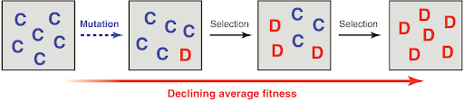<figcaption aria-hidden="true"><i>Figure 3: Evolution may drive down cooperation. Image credit MA Nowak.  </i></figcaption>

Nowak presents a theory called the "[Five Rules for the Evolution of Cooperation](#five_rules)". 
1. Kin selection operates when the donor and recipient of an altruistic act are genetic relatives. If the relatedness $r$ of individuals surpasses some cost/benefit then there can potentially be some kin selection. For example, a gazelle may make some loud noise to warn family members of a predator, even if this makes the predator more aware of it's location, as the evolutionary benefit of potentially saving its genetic kin may be greater.
2. Direct reciprocity requires repeated encounters between two individuals. This can be thought of as 'I scratch your back, you scratch mine.
3. Indirect reciprocity is based on reputation; a helpful individual is more likely to receive help.
4. Space selection/network reciprocity means clusters of cooperators out compete defectors. 
5. Group selection is the idea that competition is not only between individuals, but also between groups. Groups with a higher proportion of cooperative members may outcompete groups with a lower such proportion. For example, if one group has individuals more willing to go to war and fight, being less egoistic than the other group, they may win against the other group. Or, a group more willing to cooperate may outbreed the other and dominate without that way without genocide. 

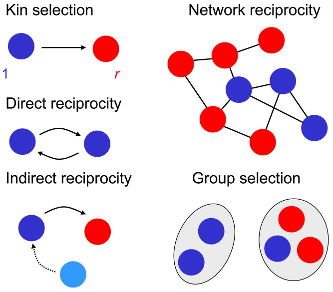<figcaption aria-hidden="true"><i>Figure 3: Five rules for the evolution of cooperation. Image credit MA Nowak.  </i></figcaption>

Another observation from nature is that micromotives need not necessarily match macrobehaviour. That is to say, groups of individuals behave as *complex systems*, and alignment of components does not garauntee alignment of the entire system. For instance, let's say agents have a preference for more than $1/3$ of their neighbours to belong to the saame group, else move. Then this mild in-group preference gets exarcebated and the individuals become highly segregated.

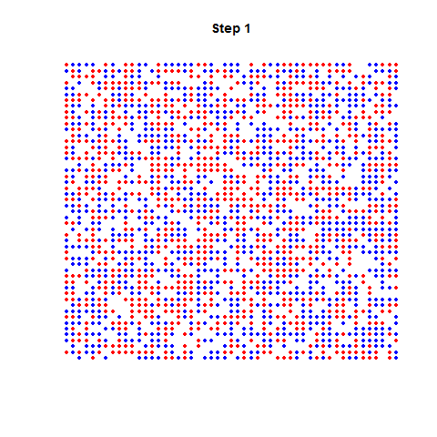<figcaption aria-hidden="true"><i>Figure 4: Schelling’s segregation model. Micromotives don't match macrobehaviour. </i></figcaption>

Turning to humans in particular, we are endowed with a set of dispositions to cooperate. [Further Reading](https://www.practicalethics.ox.ac.uk/uehiro-lectures-2022)
* Disposition to initiate help for strangers
* Disposition to reciprocate
* Disposition to contribute to a shared effort without distinct expectation of return (indirect reciprocity)
* Some intrinsic reward from success at cooperation or collaboration, beyond the actual gain produced
* Some intrinsic interest in whether other have their goals met or are treated fairly
* Disposition to penalize those who are unfair or harmful, even at some expense to oneself

Cooperation can often increase expected utility. This may relate to morality. The `morality-as-cooperation' theory asserts that "all of human morality is an attempt to solve a cooperative problem".

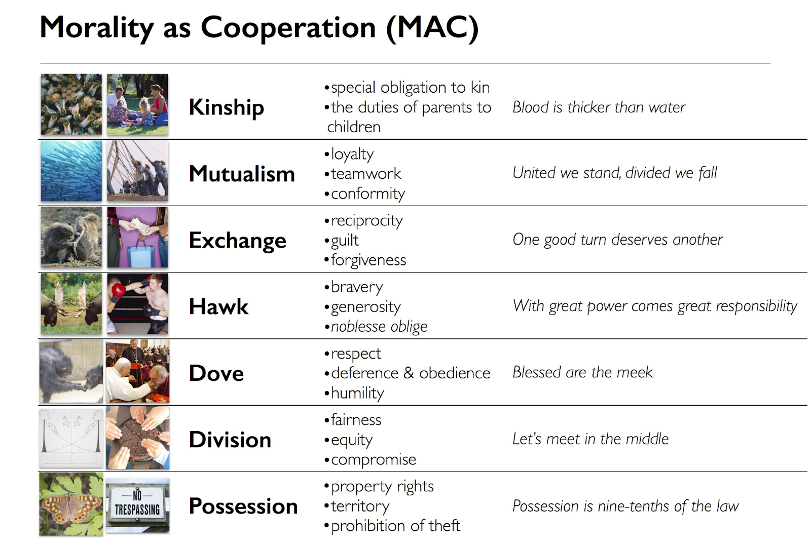<figcaption aria-hidden="true"><i>Figure 6: The morality-as-cooperation theory. </i></figcaption>

## Cooperative Intelligence in AI - reviewed up to here

AI agents do not possess the traits discussed above. They are not naturally endowed with these human dispositions, nor with the biological features biological creatures use to cooperate. They however can be constructed to have certain non biological features that may aid cooperation. The key capabilities necessary for cooperation of AI agents can be grouped into four categories

1. **Understanding** the world, behaviour and preferences of other agents, and dealing with recursive beliefs
2. **Communicating** effectively over common ground, dealing with problems of bandwidth and latency, teaching others, and efficiently tackling games with mixed motives.
3. Forming **committments** via devices such as enforcement, automated contracts and arbitration. 
4. Creating trustworthy **institutions**, with good norms and reliable reputation systems.

Cooperative AI work encompasses a wide range of research. To give a flavour of the kinds of research in each subfield, we present a representative paper for each.

## Understanding

Previous progress in coordination in zero-sum games has focused on agents competing against themselves through self-play. Examples include OpenAI's Five, or DeepMind's AlphaGo and successors. Are these systems really learning to coordinate? They fail to coordinate with other players, are hyper specialist, and require immense amounts of data to train. Even when they are coordinating, it has been shown agents are often substantially worse at coordinating with humans than with other near optimal agents.(https://papers.nips.cc/paper/2019/file/f5b1b89d98b7286673128a5fb112cb9a-Paper.pdf) By contrast, even human babies can infer intentions of others incredibly quickly in very general settings.

An integral part of human cooperation is our 'theory of mind' (ToM), that allows us to infer and understand intentions of others. How can we teach this to an AI? The paper `Too Many Cooks: Coordinating Multi-Agent Collaboration Through Inverse Planning`, by Wu et al. develops bayesian delegation as a way of doing so. 

Bayesian delegation enables agents to infer the hidden intentions of others by inverse planning. Agents may then flexibly decide in the absence of direct communication when to cooperate on the same sub task, and when to work on different sub tasks in parallel. To suceed, agents must coordinate both high level plans (which sub taks to work on), and low level actions (eg avoiding collisions). 

This is shown to work experimentally in an 'Overcooked' inspired gridworld, where two agents are cooperating to create some recipe within some time limit.

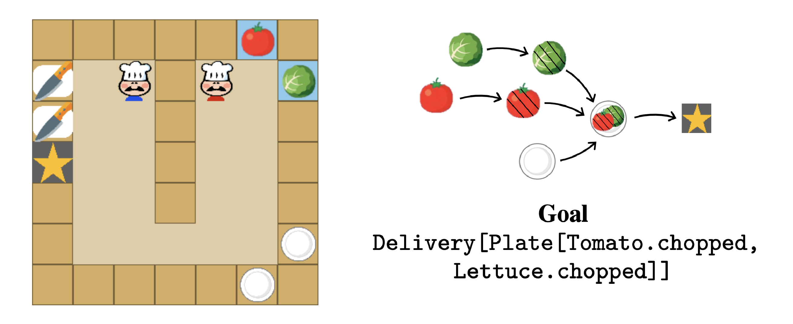<figcaption aria-hidden="true"><i>Figure x: Experimental setup in Too Many Cooks: Coordinating Multi-Agent Collaboration Through Inverse Planning. Image credit Wu et al. </i></figcaption>

https://www.youtube.com/watch?v=Fd4RcVaNthY
https://dspace.mit.edu/bitstream/handle/1721.1/138369/0157.pdf?sequence=2&isAllowed=y

## Communicating
AI has been used for a number of years already to facilitate human-human communication. Machine translation is the most prominent example. Removing barriers to communication may lead to increased international trade, higher productivity and a more bordlerless role. Other examples include text to speech and speech to text assistive technologies. An instance of human-machine commmunication is that of inputting human preferences into AI systems through methods such as comparisons, demonstrations, corrections, language, proxy rewards and direct rewards.

In comparison machine-machine communication is most neglected. Software systems today communicate through hard-coded channels and fixed protocols, allowing for domain specific cooperation. It is a challenging problem to find common ground between unrelated AI agents with potentially very different internal representations. One also wants these communication channels to be human interpretable or at least verifiable, to reduce chances of collusion.

Sukhbaatar et al. demonstrate it is possible for a group of agents to learn both a policy, and continuous communication protocol in tandem if trained silmutaneously via backpropogation. This model is simple enough such that it can combined with standard single agent RL algorithms or supervised learning, and demonstrates promising results on a handful of simple games. 

https://papers.nips.cc/paper/2016/file/55b1927fdafef39c48e5b73b5d61ea60-Paper.pdf

## Committments

One way in which humans fail to reach effiecent outcomes is through a failure of trust. Computers offer promissing tools that may allow AI to make verifiable credible commitments to each other and completely overcome this problem. von Neumann introduced the concept of the duality of computer programs
1.  A computer program can serve as a set of instructions.
2. A computer program can serve as a file, to be read and compared to, by itself or byother programs.
This leads us to the idea of *open source game theory*, presented by Tennenholtz.

Consider the prisoners dilemma. Suppose instead of actions, AI agents instead submit programs returning cooperate or defect, such as

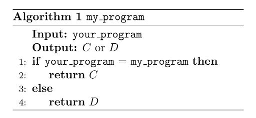<figcaption aria-hidden="true"><i>Figure x: A verifiable program for the Prisoners dilemma. </i></figcaption>

Then (my_program, my_program) determines a *program equilibrium*, which it is irrational to deviate from. Note this is a Nash equilibium in the game where players choose programs, but not in the original game. 

https://iew.technion.ac.il/~moshet/progeqnote4.pdf

## Institutions

Institutions are proven ways by which human society has becomes more cooperative. Norms, laws, and other governance structures are critical to the functioning of modern civilisation. Can AI help us create more rational and better functioning institutions for humans?

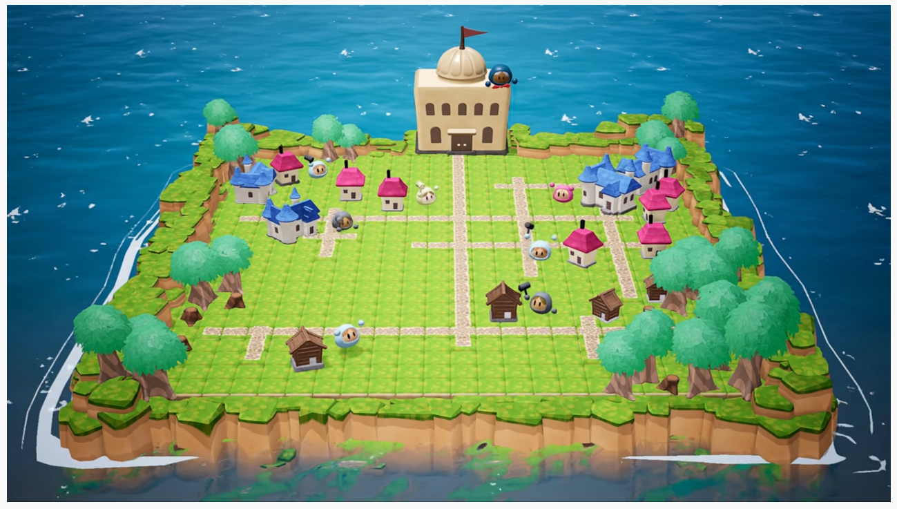<figcaption aria-hidden="true"><i>Figure x: The AI economist world </i></figcaption>

`The AI Economist` investigates whether in principle an AI can learn taxation policy that most effectively trades off between productivity and equality. RL agents are created in a gather and build gridworld, who move around, collect resources such as wood and stone, and build houses to gain coins. Mechanisms for trade allow the agents to trade resources for coin. Agents are initialised with random skill levels for the various tasks they can complete, and each task carries a labour cost to bound the system. These agents optimise to maximise coin and minimise labour. 

A second type of agent, the 'social planner' is tangentially optimizing tax and redistribution policy to improve social outcomes. In general high taxation reduces productivity as productive workers are deincentivised to work due to added labour costs for reduced economic benefit, while low taxation raises inequality.

<figcaption aria-hidden="true"><i>Figure x: The equality-productivty trade off and welath distribution in the AI economist model </i></figcaption>

The Pareto boundary defines the set of maximal trade-offs. The AI economist beats other tax policies from the economic literature. On the right, we see taxes impact productivity (total income, represented by the area of the big squares), and equality (the relative difference in sizes of the smaller squares). The AI Economist achieves the best trade-off
(measured in equality times productivity).

https://arxiv.org/pdf/2004.13332.pdf

# Potential downsides of cooperative AI

As with any technological advance, progress in cooperative AI may be dual to aggrevating certain risks. Downsides with cooperative AI fall can be classified into three broad categories.
1. Cooperative competence itself can cause harms, such as by harming those excluded from the colaberative set and underminiming pro-social forms of competition (i.e. **collusion**)
2. Advances in cooperative capabilities may, as a byproduct, **improve coercive capabilities** (e.g., deception).
3.  Successful cooperation often depends on coercion (e.g., pro-social punishment) and competition
(e.g., rivalry as an impetus for improvement), making it hard to pull these apart.
Care should therefore be taken for advances to lead to *differential progress* on cooperation. 

Concrete exampels include
* Forming credible committments could be used to make *threats*
* Reaching mutually beneficial bargaining solutions could lead to *collusion*
* Forming alliances could be used to create larger factions, and thus greater risks of *conflict*

# References
<a id="five_rules">[1]</a> 
MARTIN A. NOWAK