# Deep Learning Review
**Contributor(s): Nathaniel Li**

This is a review of the ML Safety Scholars deep learning module. Understanding deep learning is [important](https://forum.effectivealtruism.org/posts/7WXPkpqKGKewAymJf/how-to-pursue-a-career-in-technical-ai-alignment#Activities_that_are_useful_for_both_empirical_research_leads_and_contributors) for ML Safety, as it is the dominant paradigm within machine learning. This is a review, not an introduction to deep learning - instead, ML Safety Scholars suggests the first thirteen lectures of [EECS 498-007/598-005](https://web.eecs.umich.edu/~justincj/teaching/eecs498/FA2019/schedule.html) as its introductory deep learning curriculum, and [here](https://forum.effectivealtruism.org/posts/7WXPkpqKGKewAymJf/how-to-pursue-a-career-in-technical-ai-alignment#Basic_deep_learning) are additional resources.

We discuss the following topics:
*  **Model architectures**, beginning with subcomponents such as residual connections, normalization layers, and non-linearities, and continuing with more complex neural network architectures, including transformers and their associated building blocks. 
*  **Loss functions**, which assess the performance of models on data. In particular, we review information-theoretic losses such as cross entropy, and regularization techniques such as weight decay (L2 regularization). 
*  **Optimizers**, which adjust model parameters to achieve lower loss. We examine a variety of widely-adopted optimizers such as Adam, and consider learning rate schedulers, which stabilize optimization.
*  **Datasets** for vision (CIFAR and ImageNet) and natural language processing (GLUE and IMDB).

Table of Contents
-----

- [Model Architectures](#model-architectures)
  - [Residual Networks](#residual-networks)
  - [Batch and Layer Normalization](#batch-and-layer-normalization)
  - [Dropout](#dropout)
  - [Sigmoid](#sigmoid)
  - [ReLU](#relu)
  - [GELU](#gelu)
  - [Softmax](#softmax)
  - [Multilayer Perceptrons (MLPs)](#multilayer-perceptrons-mlps)
  - [Convolution](#convolution)
  - [From ResNet to ConvNeXT](#from-resnet-to-convnext)
  - [Self-Attention and Transformer Blocks](#self-attention-and-transformer-blocks)
  - [BERT and GPT](#bert-and-gpt)
- [Losses](#losses)
  - [Minimum Description Length Principle](#minimum-description-length-principle)
  - [Entropy, Cross Entropy, and KL Divergence](#entropy-cross-entropy-and-kl-divergence)
  - [l2 Regularization](#l_2-regularization)
- [Optimizers](#optimizers)
  - [Gradient Descent](#gradient-descent)
  - [SGD + Momentum](#sgd--momentum)
  - [AdaGrad and RMSProp](#adagrad-and-rmsprop)
  - [Adam and AdamW](#adam-and-adamw)
  - [Learning Rate Schedules](#learning-rate-schedules)
- [Datasets](#datasets)
  - [CIFAR](#cifar)
  - [ImageNet](#imagenet)
  - [SST-2, IMDB, GLUE, and SuperGLUE](#sst-2-imdb-glue-and-superglue)
- [References](#references)

# Model Architectures

## Residual Networks
The residual network (ResNet) was first proposed in (He et al. 2016) and achieved state-of-the-art performance in ImageNet classification. Previously, models with too many layers would underfit the training set, and consequently, the previous state-of-the-art on ImageNet only had 22 layers. 

On the other hand, ResNet enjoys gains in classification accuracy up to 152 layers, overcoming underfitting by employing **residual connections**, which add a layer's input to its output. Conceptually, residual connections make it easier for deep networks to emulate shallow networks - turn off a layer, and it becomes the identity function due to the residual connection.

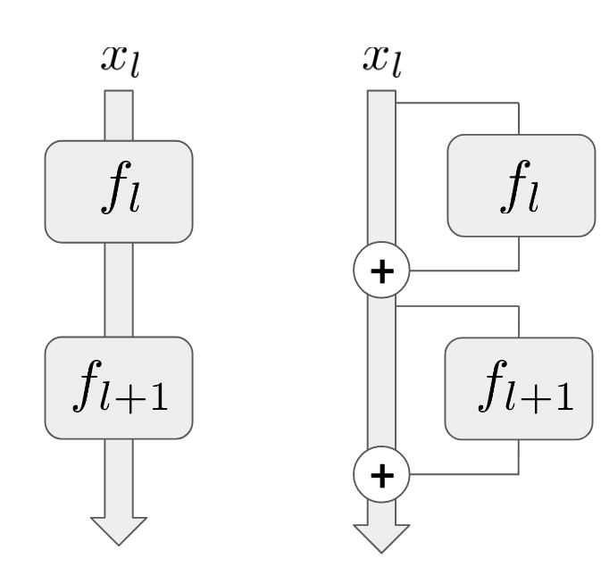<figcaption aria-hidden="true"><i>Figure 1: Diagram of a two-layer neural network (left) and the same network with two residual connections (right). Figure from Dan Hendrycks.</i></figcaption>

Concretely, both neural networks in Figure 1 contain feedforward layers $f_l$ and $f_{l+1}$, and input $x_l$. The neural network on the left represents the operation $f_{l+1}(f_l(x_l))$, but the residual network on the right represents 
$f_{l+1}(f_l(x_l) + x_l) + f_l(x_l) + x_l$. If $f_{l+1}$ were turned off, the first term would disappear and the residual network would represent a one-layer network. 

Further exploration:
* https://towardsdatascience.com/introduction-to-resnets-c0a830a288a4
* https://d2l.ai/chapter_convolutional-modern/resnet.html
* https://towardsdatascience.com/an-overview-of-resnet-and-its-variants-5281e2f56035

## Batch and Layer Normalization
Prior to training, input data is frequently standardized by subtracting the mean and dividing by the standard deviation. This ensures input features are similarly scaled, keeping model parameters similarly scaled as well, and ultimately ensuring the loss surface doesn't have extremely steep and narrow valleys that are difficult to descend.

<figcaption aria-hidden="true"><i>Figure 2: Depiction of gradient updates with standardized and non-standardized inputs. (right). Figure from <a href="https://www.jeremyjordan.me/batch-normalization/">Jeremy Jordan.</a></i></figcaption>

Batch normalization (batch norm) extends this intuition to hidden activations as well, standardizing the hidden inputs across a batch to have zero mean and unit variance (Ioffe and Szegedy 2015).[^1] After standardization, batch norm also applies an affine scale/shift operation with learned parameters

Concretely, consider activations $x$ across a batch, learned scale and shift vectors $\gamma$ and $\beta$, respectively, and a small constant $\epsilon$ to avoid dividing by zero. The new activations after batch norm, $\hat{x}$, are $$\hat{x} \leftarrow \gamma \odot \frac{x - \mathbb{E}[x]}{\sqrt{\text{Var}[x]} + \epsilon} + \beta$$ where $\odot$ is the elementwise multiplication operator.

$\mathbb{E}[x]$ and $\text{Var}[x]$ are calculated per batch, so what happens during evaluation or deployment, when batches may not be available? Batch norm keeps a running average of the variance and mean during training, and these values are used and fixed during evaluation. 

Batch-norm works well with large batch sizes, as there are more samples to calculate the mean and variance from. Unfortunately, large batch sizes can also pose memory constraints in very deep models.

**Layer normalization**, like batch normalization, conducts standardization and applies scaling and shifting with learned parameters (Ba et al. 2016). However, layer norm works across all features in the same layer/example, instead of the same feature across examples in a batch. Thus, layer norm shares the same formula as batch norm above, but $\mathbb{E}[x]$ and $\text{Var}[x]$ are calculated across the layer dimension, and $\beta$ and $\gamma$ have the same shape as the layer. As layer norm doesn't act across the batch, it functions identically during training and testing.

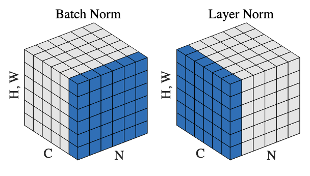<figcaption aria-hidden="true"><i>Figure 3: Batch norm standardizes single features across the batch dimension (N), while layer norm standardizes over all features (C) in a single example. The H, W dimensions represent spatial dimensions in vision data. Figure from (Wu and He 2016)</i></figcaption>

Empirically, layer norm performs slightly better and is primarily used for natural language processing tasks, while batch norm is primarily used in vision. 

Further exploration:
* https://www.youtube.com/watch?v=2V3Uduw1zwQ
* https://www.jeremyjordan.me/batch-normalization/
* https://d2l.ai/chapter_convolutional-modern/batch-norm.html

## Dropout
Dropout is a regularizer which, like batch norm, behaves differently during training and evaluation. It is parameterized by a scalar $p$ - during training, activations are randomly set to zero with probability $1-p$, and are scaled by $\frac{1}{p}$ to ensure living neurons have same expected value with and without dropout. Dropout is usually disabled during evaluation as we prefer deterministic results.

Dropout encourages robust and redundant feature detectors, by ensuring that the model withstands erasure of some activations. For a evolutionary intuition of dropout, refer to page 6 of (Hinton et al. 2012). 

<figcaption aria-hidden="true"><i>Figure 4: Comparision between a 4-layer fully-connected neural network without dropout (left) and with dropout (right). Figure from (Hinton et al. 2012)</i></figcaption>

## Sigmoid
Sigmoid is a non-linear activation function:
$$\sigma(x) = \frac{1}{1 + {e^{-x}}}$$ It is a differentiable approximation to the step function, $\textbf{1}(x>0)$.

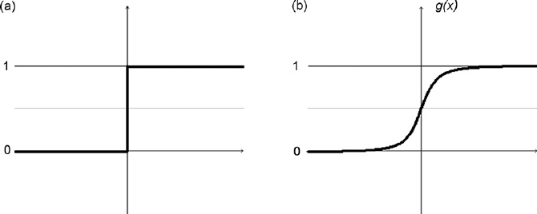<figcaption aria-hidden="true"><i>Figure 5: Graph of step function (left) and sigmoid (right). Figure from (Chen et al. 2008)</i></figcaption>
  
Sigmoid normalizes activations from domain $\mathbb{R}$ to range $(0, 1)$, and has a biological interpretation as the firing rate of a neuron. However, it can be suboptimal due to vanishing gradients, where gradients become smaller and smaller as the network becomes deeper.

## ReLU
ReLU, or the Rectified Linear Unit, is an activation function: $\text{max}(0, x)$.

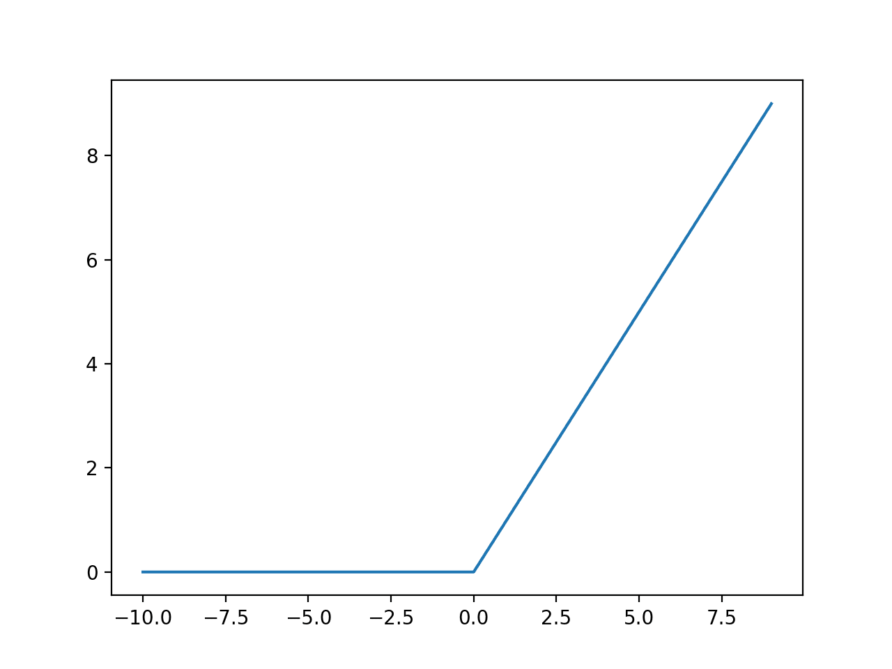<figcaption aria-hidden="true"><i>Figure 6: Graph of ReLU activation function. Figure from <a href="https://machinelearningmastery.com/rectified-linear-activation-function-for-deep-learning-neural-networks/">Jason Brownlee</a></i></figcaption>
  
ReLU can be interpreted as gating inputs based on their sign - if the input is positive, let it through; else, set the activation to zero. ReLU is still a popular activation function to this day.

## GELU
GELU, or the Gaussian Error Linear Unit, is an activation function: $x \times \Phi(x)$, where $\Phi(x) = P(X \leq x), X \sim \mathcal{N}(0,1)$, i.e. $\Phi(x)$ is the CDF of the standard normal distribution (Hendrycks and Gimpel. 2020). It is a smooth approximation to the ReLU, and empirically performs slightly better than ReLU in many tasks.

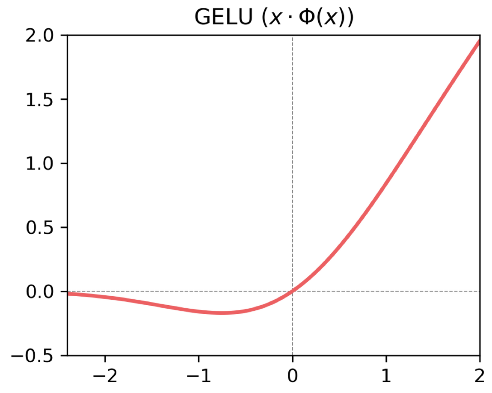<figcaption aria-hidden="true"><i>Figure 7: Graph of GELU activation function. Figure from Dan Hendrycks</i></figcaption>

## Softmax
Softmax is another activation function, transforming input vectors in $\mathbb{R}^k$ to outputs in $(0, 1)^k$. The value of softmax in the input vector's $i$ th posiition is 

$$\text{softmax}(x_1, \cdots, x_k)[i] = e^{x_i} / \sum_{j=1}^k e^{x_j}$$

The elements in the softmax vector are non-negative and sum to one, so softmax is frequently employed to transform a vector ("logits") into a final probability distribution used at the end of a neural network.

Softmax is a arbitrary-dimensional generalization of sigmoid:
$$\text{softmax}(x, y) = \frac{e^x}{e^x + e^y} = \frac{1}{1 + e^{y-x}} = \sigma(x-y)$$

Further exploration: 
* https://www.pinecone.io/learn/softmax-activation/
* https://eli.thegreenplace.net/2016/the-softmax-function-and-its-derivative/

## Multilayer Perceptrons (MLPs)
Weight-matrices $W_i$ and activations $\phi_i$ can be combined to create MLP blocks of arbitrary depth. Example of a two-layer MLP with input $x$, activation function $\phi$, and weight matrices $W_1$ and $W_2$: $W_2 \, \phi(W_1 x)$

## Convolution
An alternative to fully connected networks with weight matrices is convolution. Since many useful data features may be local, a kernel (smaller matrix) can be slid across all spatial positions of the input, and the inner product between the kernel and input is computed at every position. This [GIF](https://eg.bucknell.edu/~cld028/courses/357-SP21/images/ConvEx.gif) provides a useful visual demonstration.[^2]

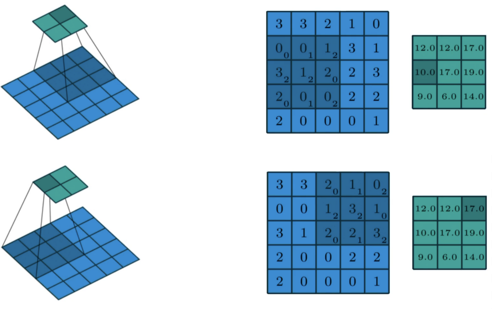<figcaption aria-hidden="true"><i>Figure 8: The inner product between the convolutional kernel and activations are taken at every position, forming the output on the right (in teal) </i></figcaption>

Convolution uses less parameters than fully-connected layers, as the same kernel is reapplied across the entire input. Convolution is also translation equivariant - if a portion of an image is shifted one pixel to the right, a kernel can just detect it by shifting itself to the right as well, while a fully-connected layer must relearn its weight matrix. Thus, convolutions are useful in vision tasks, where objects could be shifted around in an image and still hold the same meaning.

Further exploration:
* https://colah.github.io/posts/2014-07-Understanding-Convolutions/
* https://colah.github.io/posts/2014-07-Conv-Nets-Modular/
* https://eg.bucknell.edu/~cld028/courses/357-SP21/NN/convTF-Walk-Thru.html

## From ResNet to ConvNeXT
ConvNeXT is a modern vision model with a surprisingly similar structure to ResNet, despite being separated by many years in time.

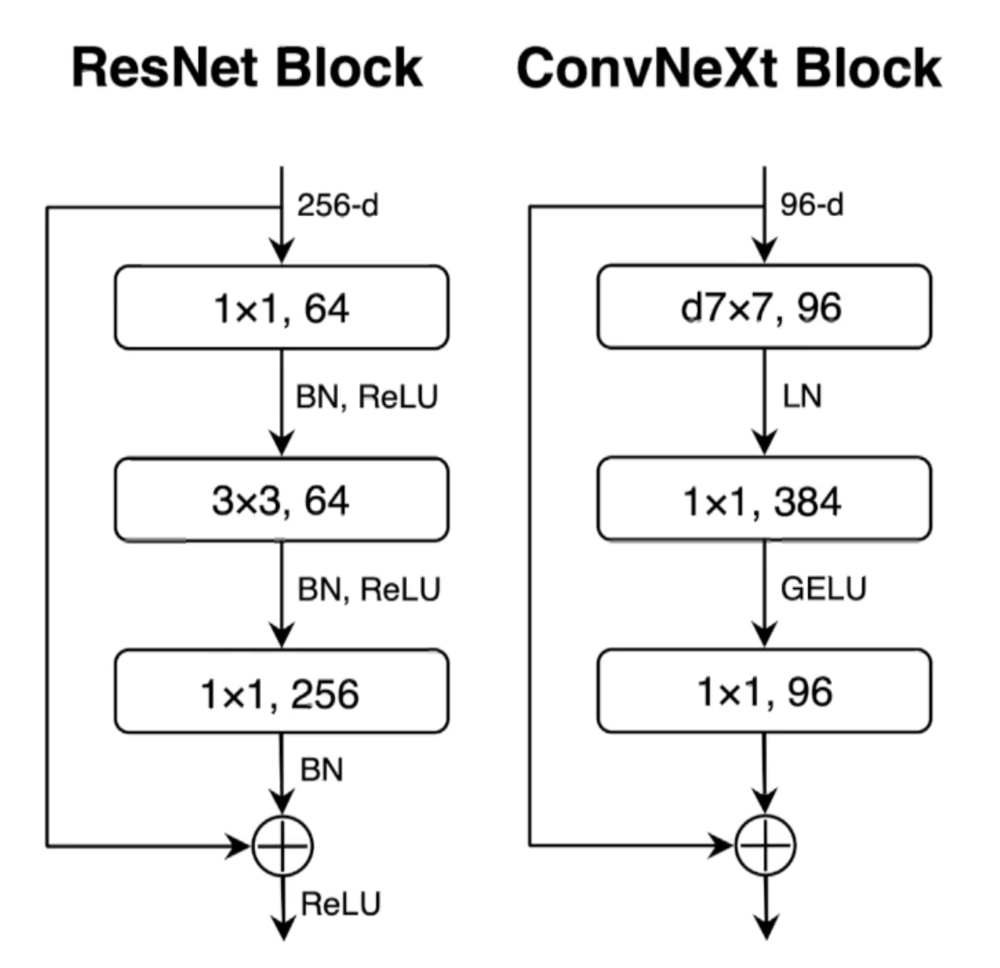<figcaption aria-hidden="true"><i>Figure 9: Depiction of a single ResNet and ConvNext block. Figure from Dan Hendrycks</i></figcaption>

Both ResNet and ConvNeXT are deep networks with repeated blocks stacked on top of each other, and both employ residual connections in each block. However, ConvNeXT uses more recent developments such as GELU and layer norm, rather than ReLU and batch norm (Liu et al. 2022). Nevertheless, the overall structure of modern vision models remain similar to the past, and ConvNeXT summarizes some key architectural developments of the past 7 years.

Further exploration:
* https://medium.com/augmented-startups/convnext-the-return-of-convolution-networks-e70cbe8dabcc

## Self-Attention and Transformer Blocks
Nathaniel could never explain self-attention as succinctly as this [high level overview](https://www.youtube.com/watch?v=-9vVhYEXeyQ) or [more thorough explanation](https://jalammar.github.io/illustrated-transformer/), so please check out these amazing resources and the original paper (Vaswani et al. 2017). Additionally, here is a drawing of the flow of attention and the dimensions at every step:

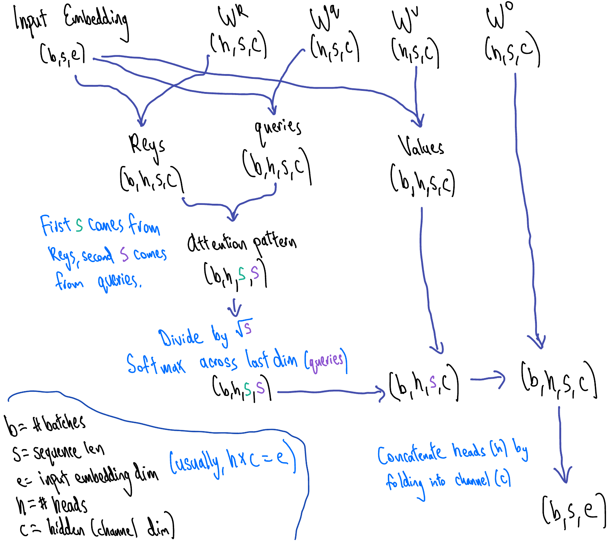<figcaption aria-hidden="true"><i>Figure 10: Please forgive Nathaniel's atrocious handwriting. Figure from Nathaniel Li</i></figcaption>

Transformer blocks build upon the self-attention mechanism and have become a critical building block of most modern language models. They consist of self-attention and MLP layers, with residual connections and layer normalization between both layers.

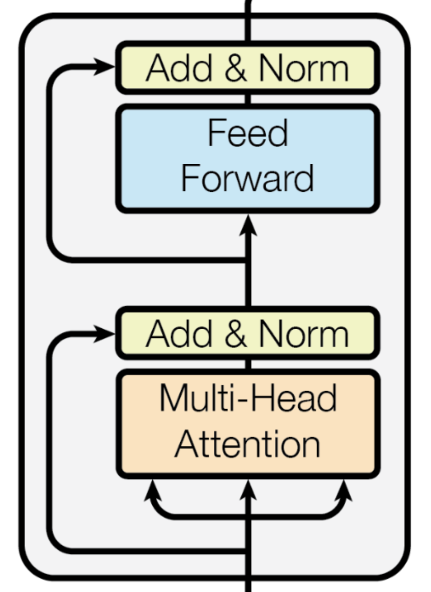<figcaption aria-hidden="true"><i>Figure 11: A single transformer block. Figure from (Vaswani et al. 2017)</i></figcaption>

Further exploration:
* https://nlp.seas.harvard.edu/2018/04/03/attention.html
* https://lilianweng.github.io/posts/2018-06-24-attention/

## BERT and GPT

Transformer blocks are highly modular and can be stacked to create deep models, including BERT and GPT (Radford et al. 2018, Devlin et al. 2019).

BERT consists of stacked **encoders**, or normal transformer blocks with full attention layers. BERT is **bidirectional**, meaning it makes predictions by incorporating context from future and past words. The model was trained using **masked language modeling** - it is fed a large dataset of text with some of the words randomly masked, and it tries to guess these masked words.

GPT consists of stacked **decoders**, or altered transformer blocks with the top-right triangle of the attention pattern erased. GPT is **unidirectional** or **autoregressive**, meaning it only uses context from previous tokens to make predictions.[^3] It was trained with the **causal language modeling** objective, guessing the next word conditional on some previous phrase.

Since GPT is unidirectional, it is useful for tasks where only previous context is necessary, such as text generation, while BERT is useful for tasks which require broader context in both directions, such as sentiment classification. BERT and GPT's training schemes allow it to be trained on large corpora of unlabeled data, such as Wikipedia.

<figcaption aria-hidden="true"><i>Figure 12: Decoder blocks mask out the top-right triangle of the attention score, so predictions can only use context from previous words. Figure from <a href="https://towardsdatascience.com/illustrated-guide-to-transformers-step-by-step-explanation-f74876522bc0">Michael Phi</a></i></figcaption>

# Losses

## Minimum Description Length Principle
The Minimum Description Length Principle is the backbone of many information-theoretic losses. It views learning as data compression, and describing events more succinctly as evidence of understanding.

Imagine we wanted to encode a sequence of As, B, and Cs in binary, where at any position in the sequence, $P(A) = 0.4, P(B) = 0.4$, and $P(C) = 0.2$. Efficient coding schemes give likelier events shorter descriptions, as they occur more often (e.g. encoding A and B with `0` and `1`, while encoding C with `00`). In fact, for character A and its probability $P(A)$, the [maximally efficient coding scheme](https://en.wikipedia.org/wiki/Minimum_message_length) encodes A with $-\log(P(A))$ symbols, modulo rounding. The base of the logarithm depends on the size of the encoding alphabet (2 in the binary case). 

In ML, we often implicitly select the model which has the shortest description length, as we often optimize for attaining the smallest log-loss.

## Entropy, Cross Entropy, and KL Divergence
Continuing the minimum description length example, entropy is the expected length of the optimal encoding scheme $S$. If character $i$ has probability $p_i$, the entropy is 

$$H(S) = \mathbb{E}[S(p)] = \mathbb{E}[-\log p(X)] =  -\sum_{i=1}^k p_i \log p_i$$

Entropy can also be considered as a measure of a random variable's uncertainty:

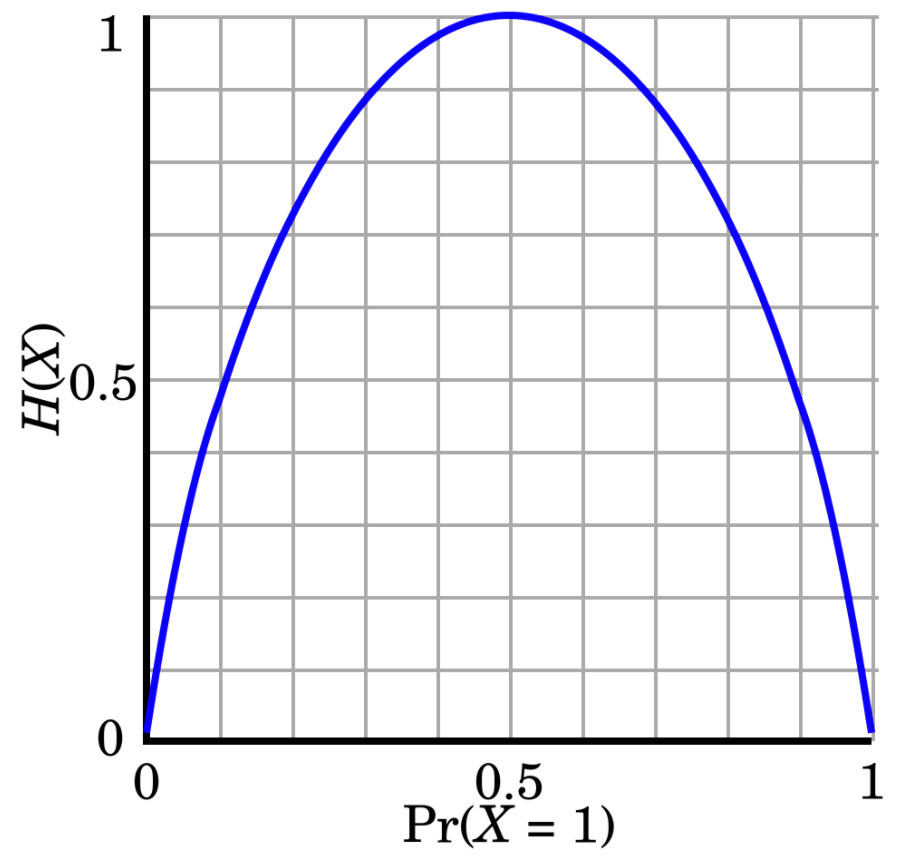<figcaption aria-hidden="true"><i>Figure 13: Entropy of a Bernoulli random variable; the entropy is minimized when there isn't any uncertainty in the model (X is either always 0 or 1). Figure from <a href="https://en.wikipedia.org/wiki/Binary_entropy_function">Wikipedia</a></i></figcaption>

Cross entropy measures the difference between two probability distributions, and is commonly used as an information-theoretic loss in machine learning, by comparing the model's predicted probability distribution with the true probability distribution. In the context of minimum description length, cross entropy measures the number of symbols needed to encode events, under the optimal encoding scheme for a different probability distribution.

The cross entropy between probability distributions $p$ and $q$ can be expressed as 

$$H(p; q) = \mathbb{E}[- \log{q}] = - \sum_{i=1}^{n}\mathbb{P}(p_i)\log{\mathbb{P}(q_i)}$$

Notice that $H(p; q) = \infty$ if $\exists i, q_i=0, p_i \neq 0$, as $-\log{\mathbb{P}(q_i)} = \infty$. Cross-entropy is also asymmetric: $H(p; q) \neq H(q; p)$.

Lastly, Kullback-Leibler (KL) Divergence is another metric of the difference between two probability distributions. It is expressed as 
$$\text{KL}[p|| q] = -\sum_{i=1}^k p_i \log \frac{q_i}{p_i}$$

Using an optimal encoding scheme for distribution $q$ to model distribution $p$, $\text{KL}[p\| q]$ measures the number of additional symbols necessary for encoding, compared to the optimal encoding. As a result, the KL divergence of $p$ and $q$ is the difference between the entropy of $p$ and the cross entropy between $p$ and $q$: 
$$\text{KL}[p|| q] =  -\sum_{i=1}^k p_i \log \frac{q_i}{p_i} = -(\sum_{i=1}^k p_i \log q_i - \sum_{i=1}^k p_i \log p_i) = H(p; q) - H(p)$$

Further exploration:
* https://brilliant.org/wiki/entropy-information-theory/
* https://www.countbayesie.com/blog/2017/5/9/kullback-leibler-divergence-explained
* https://raw.githubusercontent.com/mtomassoli/papers/master/inftheory.pdf

## $l_2$ Regularization

$l_2$ regularization penalizes model complexity by adding the $l_2$ norm of all model parameters $\theta$ to the loss. It uses multiplicative hyperparameter $\lambda$ to adjust the size of the regularization term: $\lambda ||\theta||_2 $. Because each parameter is squared, $l_2$ regularization reduces reliance on a few large parameters. Instead, it distributes values across many similarly-sized parameters, which can lead to more robust networks. Reducing model complexity can also prevent overfitting, as shown below.

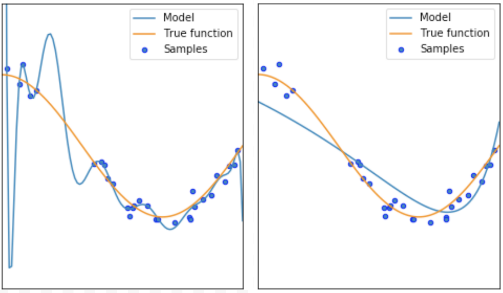<figcaption aria-hidden="true"><i>Figure 14: Depictions of models trained without regularization (left) and with regularization (right). The model with regularization is simpler and does not overfit. Figure from Dan Hendrycks</i></figcaption>

$l_2$ regularization can be interpreted as penalizing the amount of information needed to encode the parameters, as a larger norm means more information. $l_2$ regularization also enforces a [Gaussian prior](https://stats.stackexchange.com/a/163450) on the model parameters, with mean 0 and variance inversely proportional to $\lambda$.

Further exploration:
* https://d2l.djl.ai/chapter_multilayer-perceptrons/weight-decay.html#squared-norm-regularization

# Optimizers

## Gradient Descent
Gradient descent minimizes the loss $\mathcal{L}(\theta)$ with respect to parameters $\theta$, by iteratively moving in the direction of steepest descent with hyperparameter step size $\alpha$: 
$$\theta_{k+1} = \theta_{k} - \alpha \nabla\theta_k$$

Stochastic gradient descent (SGD) computes the gradient and updates the parameters on a single sample, while batch gradient descent averages the gradient across the whole dataset before updating the parameters. More commonly, **mini-batch** gradient descent is used, where the model updates on a fixed number of samples on every iteration.

Using naive gradient descent could pose three issues:
* The gradients can be noisy as they come from few samples. 
* The model could get stuck in local minima or saddle points, preventing it from reaching even lower losses.
* If the loss changes quickly in one direction but not another, the model could "bounce" along the sides of the loss landscape, leading to slow convergence.

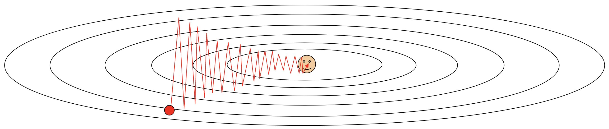<figcaption aria-hidden="true"><i>Figure 15: Contour plot of a loss landscape, demonstrating slow convergence with gradient descent. Figure from <a href="https://www.youtube.com/watch?v=YnQJTfbwBM8">Justin Johnson</a></i></figcaption>

Further exploration:
* https://www.youtube.com/watch?v=IHZwWFHWa-w

## SGD + Momentum
SGD + Momentum expands on SGD, incorporating a velocity ($v$) term as a running mean of gradients, which a friction term ($\rho$) to integrate some of the previous gradients into the current velocity:
$$v_{t+1} = \rho v_t + \nabla\theta_t$$
$$\theta_{t+1} = \theta_t - \alpha v_{t+1}$$

SGD + Momentum resolves some of the issues in using naive gradient descent:
* Gradients which come from single examples or mini-batches are less noisy, as they are averaged out with gradients from previous vectors.
* The model is less likely to get stuck in local minima or saddle points, as it has momentum or "pre-existing velocity" to overcome inclines or flat areas on the loss surface.
* Momentum yields smoother gradients over time, preventing "bouncing" along directions with large gradients.

## AdaGrad and RMSProp

Another optimization algorithm is AdaGrad, which employs different learning rates on every parameter based on its historical gradients (Duchi, Hazan, and Singer 2011).

Let $s$ be the historical squared gradients for each parameter, summed over all previous iterations, and $\epsilon$ be a small number to avoid dividing by zero. Then, the AdaGrad update rule is:
$$s_{t+1} = s_{t} + \nabla \theta_t^2$$
$$\theta_{t+1} = \theta_t - \frac{\alpha \nabla\theta_t^2}{\sqrt{s} + \epsilon}$$

Elements of $s$ are larger if they've had larger historical gradients, so AdaGrad has the effect of smoothing gradients, reducing progress along dimensions with larger gradients, and accelerating progress along dimensions with smaller gradients. Moreover, the elements of $s$ continue to increase with more iterations, effectively slowing down learning over time. This could be problematic if optimization halts before convergence.

RMSProp is a "leaky" variation of AdaGrad which overcomes this issue, adding a decay rate hyperparameter, $\rho$, to the squared gradient calculation:
$$s_{t+1} = \rho s_{t} + (1 - \rho) \nabla \theta_t^2$$
$$\theta_{t+1} = \theta_t - \frac{\alpha \nabla\theta_t^2}{\sqrt{s} + \epsilon}$$

## Adam and AdamW

Adam is a commonly used optimization algorithm which combines ideas from SGD + Momentum and RMSProp (Kingma and Ba 2014). Let $\rho_1$ be the friction term from SGD + Momentum and $\rho_2$ be the decay rate term from RMSProp. Then, the update rule for Adam is:
$$v_{t+1} = \frac{\rho_1v_t + (1 - \rho_1) \nabla\theta_t}{1 - \rho_1^t}$$
$$s_{t+1} = \frac{\rho_2v_t + (1 - \rho_2) \nabla\theta_t^2}{1 - \rho_2^t}$$
$$\theta_{t+1} = \theta_t - \frac{\alpha v_{t+1}}{\sqrt{s_{t+1}} + \epsilon}$$

Notice that the update rules for $v_{t+1}$ and $s_{t+1}$ are divided by $1 - \rho^t$. At the beginning of learning, both $v$ and $s$ are noisy as they are derived from a small sample of data, so this corrects for some of the bias which could be present at the beginning of learning, and tapering off with more iterations.

AdamW is a variation of Adam which incorporates $l_2$ regularization at the last step of the update rule (Loshchilov and Hutter 2017):
$$\theta_{t+1} = \theta_t - \frac{\alpha v_{t+1}}{\sqrt{s_{t+1}} + \epsilon} - \lambda ||\theta||^2$$ 

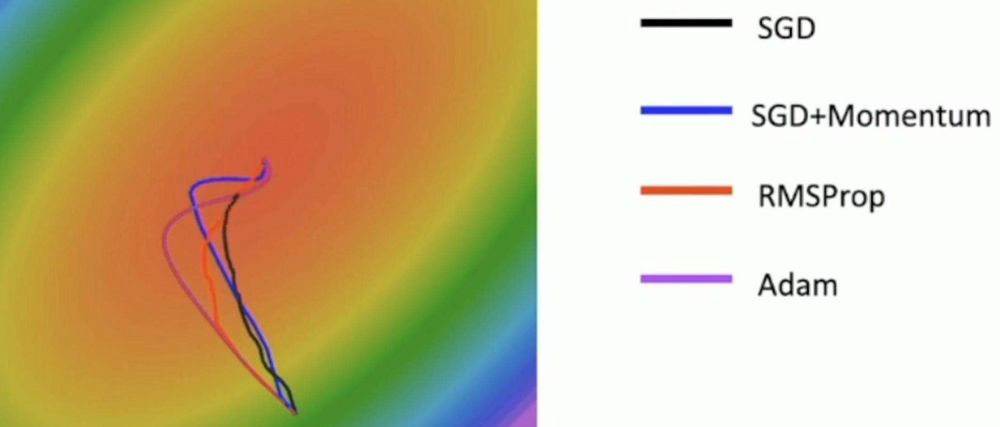<figcaption aria-hidden="true"><i>Figure 16: Depiction of various optimization algorithms traversing a loss landscape (red is lower loss). Figure from <a href="https://www.youtube.com/watch?v=YnQJTfbwBM8">Justin Johnson</a></i></figcaption>

## Learning Rate Schedules
Learning rates are not always constant over training, and can decay following a schedule.
* Linear: decays learning rate a constant amount each iteration.
* Cosine Annealing: decays learning rate proportional to cosine function, evaluated from 0 to $\pi$.

# Datasets

## CIFAR
CIFAR-10 and CIFAR-100 are vision datasets with 10 and 100 classes respectively, such as airplane and cat (Krizhevsky et al. 2009). Each dataset has 50,000 training and 10,000 test images. CIFAR-10 and CIFAR-100 have mutually exclusive classes, making it useful anomaly detection research - one dataset can be set as in-distribution and the other as out-of-distribution (Hendrycks et al. 2019). CIFAR contains small images (32 by 32 pixels) useful for quick experimentation and accessible research. 

<figcaption aria-hidden="true"><i>Figure 17: Classes and sample images from CIFAR-10. Figure from (Krizhevsky et al. 2009)</i></figcaption>

## ImageNet
ImageNet contains full-sized images covering 1,000 classes, with 1.2 million training images and 50,000 evaluation examples (Deng et al. 2009). ImageNet-22K is a larger version with ~22 thousand classes, and ~10x the number of training examples. Convolutional Neural Networks that are pre-trained on ImageNet tend to have strong visual representations, and can be used for transfer learning on other tasks.

## SST-2, IMDB, GLUE, and SuperGLUE
SST-2 and IMDB are NLP datasets for binary sentiment analysis, consisting of movie reviews from experts and normal movie-watchers, respectively.

GLUE and SuperGLUE are larger, more computationally intensive datasets. They aggregate model performance over several tasks, such as sentiment analysis and natural language inference, allowing a holistic view of a model's performance on many tasks. These benchmarks are commonly used to show how pre-trained language models perform on downstream tasks.

# References

Ba, J. L., Kiros, J. R., & Hinton, G. E. (2016). Layer Normalization. https://doi.org/10.48550/arXiv.1607.06450

Chen, S. H., Jakeman, A. J., & Norton, J. P. (2008). Artificial Intelligence techniques: An introduction to their use for modelling environmental systems. Mathematics and Computers in Simulation, 78(2–3), 379–400. https://doi.org/10.1016/j.matcom.2008.01.028

Deng, J., Dong, W., Socher, R., Li, L. J., Li, K., & Fei-Fei, L. (2009, June). Imagenet: A large-scale hierarchical image database. In 2009 IEEE conference on computer vision and pattern recognition (pp. 248-255). Ieee.

Devlin, J., Chang, M.-W., Lee, K., & Toutanova, K. (2019). BERT: Pre-training of Deep Bidirectional Transformers for Language Understanding (arXiv:1810.04805). arXiv. http://arxiv.org/abs/1810.04805

Duchi, J., Hazan, E., & Singer, Y. (2011). Adaptive subgradient methods for online learning and stochastic optimization. Journal of machine learning research, 12(7).

He, K., Zhang, X., Ren, S., & Sun, J. (2016). Deep Residual Learning for Image Recognition. 2016 IEEE Conference on Computer Vision and Pattern Recognition (CVPR), 770–778. https://doi.org/10.1109/CVPR.2016.90

Hendrycks, D., Basart, S., Mazeika, M., Mostajabi, M., Steinhardt, J., & Song, D. (2019). Scaling out-of-distribution detection for real-world settings. arXiv preprint arXiv:1911.11132.

Hendrycks, D., & Gimpel, K. (2020). Gaussian Error Linear Units (GELUs) (arXiv:1606.08415). arXiv. http://arxiv.org/abs/1606.08415

Hinton, G. E., Srivastava, N., Krizhevsky, A., Sutskever, I., & Salakhutdinov, R. R. (2012). Improving neural networks by preventing co-adaptation of feature detectors (arXiv:1207.0580). arXiv. http://arxiv.org/abs/1207.0580

Krizhevsky, A., & Hinton, G. (2009). Learning multiple layers of features from tiny images.

Ioffe, S., & Szegedy, C. (2015). Batch Normalization: Accelerating Deep Network Training by Reducing Internal Covariate Shift (arXiv:1502.03167). arXiv. http://arxiv.org/abs/1502.03167

Liu, Z., Mao, H., Wu, C.-Y., Feichtenhofer, C., Darrell, T., & Xie, S. (2022). A ConvNet for the 2020s (arXiv:2201.03545). arXiv. http://arxiv.org/abs/2201.03545

Loshchilov, I., & Hutter, F. (2017). Decoupled weight decay regularization. arXiv preprint arXiv:1711.05101.

Radford, A., Narasimhan, K., Salimans, T., & Sutskever, I. (2018). Improving language understanding by generative pre-training.

Vaswani, A., Shazeer, N., Parmar, N., Uszkoreit, J., Jones, L., Gomez, A. N., Kaiser, L., & Polosukhin, I. (2017). Attention Is All You Need (arXiv:1706.03762). arXiv. http://arxiv.org/abs/1706.03762

Wu, Y., & He, K. (2018). Group Normalization (arXiv:1803.08494). arXiv. http://arxiv.org/abs/1803.08494

[^1]: Batch and layer normalization are misnomers - while standardization adjusts data to have zero mean and unit variance, normalization actually refers to scaling the data into the range [0, 1]. In the vector case, normalization means dividing by the norm.
[^2]: In this example, the blue matrix is the input, the smaller green matrix is the convolutional kernel, and the red matrix on the right is the output.
[^3]: Why would GPT waste half of its attention pattern by masking it out? This actually allows it to generate text a linear factor faster than BERT, GPT it only needs to compute the attention pattern related to the most recent word instead of recalculating the attention pattern for all words every time.
<!--- Make sure to add links to the sections afterwards -->
<!--- I want to talk about GPT and BERT even though it isn't covered in dan's lecture; maybe weight initialization? -->
