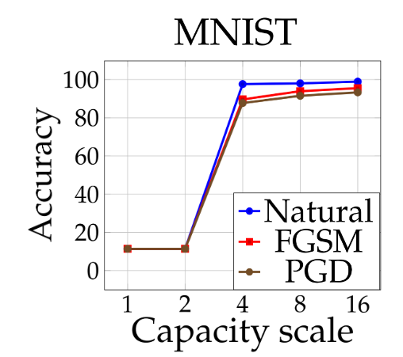
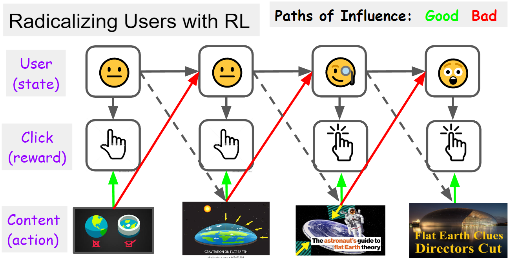
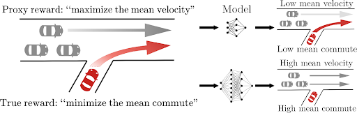
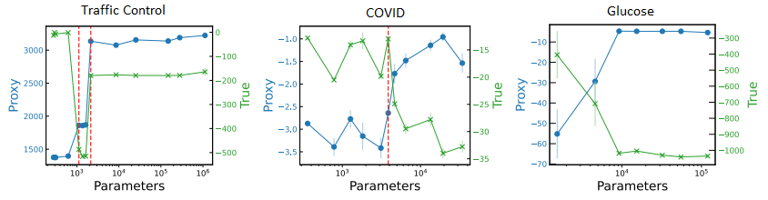
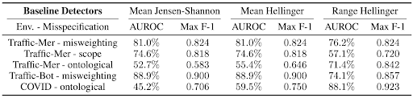

# Emergent Behaviour
**Contributor(s): Bilal Chughtai**

This lecture discusses emergent behaviour. Discussion surrounding emergent behaviour in AI Safety can sometimes be fairly speculative, so we ground our discussion with a discussion of detecting emergent proxy gaming.

It is difficult to ensure the safety of models if we do not know what they are capable of, if for example there is a performance spike where a capability turns on suddenly upon scaling to more compute or data. A concrete example could be a programming bot that suddenly learns how to access the internet and hack. Unfortunately, recent work has shown cases like this to be fairly common. We present several distinct kinds of emergent capability, some of which are substantially more difficult to detect than others.

## Performance Spikes

Some models possess quantitative capabilities that are hard to predict. For example, an [adversarially trained MNIST model](#mnist) has it's accuracy discontinuously increase as it's capability scale increases. TODO: define what precisely this means

 
<i>Figure 1: MNIST classification accuracy suddenly increases as capacity is scaled. </i>

## Unanticipated Behaviour

More problematically, some capabilities can be entirely *unanticipated*. Qualitatively distinct capabilities may spontaneously emerge, even if we do not train models to have these capabilities explicitly; a key step towards general intelligence. Large language models, such as GPT-3, are trained to predict the next token in a sequence of words. We see empirically that as the number of parameters are scaled these models become capable of [performing tasks they were not explicitly trained on](#predictability_and_surprise), including
* Three digit addition
* [Massive multitask language understanding](#MMML): answering multiple choice questions on elementary mathematics, US history, computer science, law, and more
* program synthesis: writing code

 
<i>Figure 2: Large language models have untancipated spontaneously emergent capabilities. </i>

## Emergent Internal Computation

Sometimes, interpretable emergent internal computation can emerge. Some self-supervised vision Transformers [learn to use self-attention to segment images](#vision_transformers), even without explicit segmentation supervision. This can be seen by producing saliency maps thresholding the self attentions maps to retain 60% of the probability mass. The vision transformer is able to learn an internal segmentation of images, even without being explicitly trained on this task.

 
<i>Figure 3: Self-supervised Vision Transformers learn to use self-attention to segment images without explicitly training on this task. </i>

## Grokking 

[Grokking](#open_ai_grokking) is a phenomenon by which emergent capabilities may result from scaling the number of *optimization steps* rather than model size. Model's undergo a *phase transition*, suddenly generalizing and sharply increasing validation accuracy, after initially only memorizing and overfitting to training data. 

 
<i>Figure 4: Grokking on a modular division task </i>

Recent work on [interpretability of grokking](#neelnanda) claims grokking is really all about phase changes. If one takes a task exhibiting phase changes, limit the data and regularising just enough such that the generalised solution is preferred over the memorised solution, we see grokking only marginally favours the generalising solution over the memorised solution. Furthermore, in the modular addition task studied, grokking is the model interpolating smoothly between the memorising and generalising solution, and not just some random walk.

## Instrumental Goals
Instrumental goals provide reason for us to want to better understand and detect emergent behaviour in future AI systems. A concrete example would is self-preservation, which increases the probability any agent is able to accomplish its goals; an agent can't achieve it's goals if it's off or dead. We see this manifest in biological creatures and institutions, so should expect powerful future AI systems to also *instrumentally converge* to this goal. This jargon is used for goals so useful that it is a likely tendency for various sufficiently advanced agents to attain them. Other examples include seeking power, cognitive enhancement, and obtaining resources.

## Future Work

Future work in detecting and forecasting emergent capabilities and goals could include:
* developing benchmarks to detect qualitatively distinct emergent behaviour
* developing tools to better foresee unexpected jumps in capabilities
* developing infrastructure to improve the rate at which researchers can discover hidden capabilities when interacting with models
* creating diverse testbeds with many not-yet-demonstrated capabilities and screen new models to see if they possess them

# Proxy Gaming

The *cobra effect* is an anecdote of an occurrence in India during British rule. The British government, concerned about the number of venomous cobras in Delhi, offered a bounty for every dead cobra. Initially, this was a successful strategy; large numbers of snakes were killed for the reward. Eventually, however, enterprising people began to breed cobras for the income. When the government became aware of this, the reward program was scrapped. When cobra breeders set their now-worthless snakes free, the wild cobra population further increased. Can you spot the proxy gaming? We see the proxy goal of a bounty for each dead cobra failed at achieving the objective of a reduce cobra population, as it was *over-optimized* or *gamed* through raising cobras for slaughter. 

If one seeks to optimise website user satisfaction, a proxy may be the number of clicks. This can be gamed through promoting clickbait, or through addicting users. The AI agent does not care whether the content converges to the user's interests, or the users interests converge to the content. This observation has been termed [auto-induced distributional shift](#krueger) and has been shown to be detectable in principle.

 
<i>Figure 5: Clickbait is a pathway to radicalize users and change their preferences. The red paths of influence should be disincentized, while the green paths are okay. Image credit David Krueger.</i>

Students are very familiar with proxy gaming. The university or schools goal to teach students is measured using the proxy of exam results. This can be gamed through working on exam technique, or cramming.

One can find many examples of proxy gaming in the reinforcement learning paradigm. [CoinRun](#coinrun) is a Sonic the Hedgehog platformer inspired game in which the agent needs to reach a coin in a linear platform level. During training, this coin was always placed at the end of a level. If the coin is moved, we see the agent does not generalise, but instead just runs to the end of the level. It has learned a bad proxy.

 
<i>Figure 5: The training coin run task</i>

 
<i>Figure 6: Coin run does not generalise</i>

Another classic example is from a [boat racing game](#openai_boat). An RL agent was given the goal of achieving a high score in this game as a proxy for completing the circuit, but  instead found obtaining score through 'turbo boosting' on loop, and also crashing, burning, colliding into other boats, and going in the wrong direction... 

 
<i>Figure 7: Proxy gaming in a boat game</i>

Recall *Le Châtelier's principle* from high school chemistry. This states that if a dynamic equilibrium is disturbed by changing the conditions, the position of equilibrium shifts to counteract the change to reestablish an equilibrium. In general this applies to many adaptive systems.

*Goodhart's Law* is a heuristic stating that any observed statistical regularity will tend to collapse once pressure is placed upon it. Or, overly simplified: when a measure becomes a target, it ceases to be a good measure. This simplification should not be extrapolated too far and taken to mean all metrics are useless, as then no goal would be worth pursuing. Some goals are better than others however; they are *more robust* to optimisation pressures. GDP is a better proxy for national wealth than a worker's performance review is a proxy for employee quality.

A number of factors contribute to poor objective approximations by proxies
* approximation errors arise due to limited oversight (spatially and temporally) 
* computational costs
* measurement error
* evaluation costs
* lack of adaptivity or robustness to distribution shift and adversaries
* lack of complete foresight of structural proxy problems
* difficulty of encapsulating everything that the proxy setter actually cares about

Recent work has attempted to formally [define and characterize](#krueger2) proxy gaming. They define a proxy to be *ungameable* if increasing the expected proxy return can never decrease the return according to the true reward. Under this strict (but potentially incorrect) definition it seems that optimizing a proxy is almost always bad, and we should view optimization as a *heuristic* and not a goal.

Deficient proxies seem ubiquitous. Further work could attempt to create optimization algorithms accounting for the fact that the proxy is not perfect, find better ways of detecting when proxy gaming os occurring, or find ways to make proxies more robust.

## A Proxy Gaming Detection Benchmark

[Pan et al. ](#pan) present a benchmark for detecting proxy gaming. They use four distinct environments: traffic control, glucose monitoring, covid response, and an Atari game. Here, we'll just discuss the traffic environment. An autonomous vehicle (AV) simulation models vehicles driving on a highway network, controlled by an RL policy. The RL agent has access to observations only from the AVs it controls i.e. the car's positive and velocity, and the position and velocity of the cars immediately in front and behind. The RL acts through modifying its AV's acceleration. 

 
<i>Figure 8: Schematic of the traffic control environment.</i>

Stronger optimizers, with more parameters or training steps may have access to a larger action space at finer resolution, so may better exploit misspecifications in this environment. Misspecifications are grouped into three classes:
1. **Misweighting**. Suppose that the true reward is a linear combination of commute time and acceleration (for reducing carbon emissions). Downweighting the acceleration term thus underpenalizes carbon emissions. In general, misweighting occurs when the proxy and true reward capture the
same desiderata, but differ on their relative importance. 
2. **Ontological**. Congestion could be operationalized as either high average commute time or low average vehicle velocity. In general, ontological misspecification occurs when the proxy and true
reward use different desiderata to capture the same concept. Figure 8 shows this.
3. **Scope**. If monitoring velocity over all roads is too costly, a city might instead monitor them only over highways, thus pushing congestion to local streets. In general, scope misspecification occurs when the proxy measures desiderata over a restricted domain (e.g. time, space).

 
<i>Figure 9: True reward vs proxy reward in benchmark environments. This shape of graph is characteristic of proxy gaming.</i>

A baseline to detect emergent proxy gaming is to use *policies as detectors*. One can measure the distance between a trusted policy, such as the Intelligent Driver Model, a widely accepted approximation of human driving behaviour and the learned policy. Three different methods of doing this are evaluated, using two measurements of effectiveness (AUROC and Max F-1), across several types of misspecification in various environments Traffic-Mer refers to the merge-in traffic problem discussed above. 

 
<i>Figure 10: Baseline detector scores in a number of proxy gameable environments.</i>

# References

Madry et al. (2019), Towards Deep Learning Models Resistant to Adversarial
Attacks, https://arxiv.org/abs/1706.06083

 

Ganguli et al. (2022), Predictability and Surprise in Large Generative Models, https://arxiv.org/abs/2202.07785

 

Hendrycks et al. (2020),Measuring Massive Multitask Language Understanding, https://arxiv.org/abs/2009.03300

 

Caron et al. (2021), Emerging Properties in Self-Supervised Vision Transformers, https://arxiv.org/abs/2104.14294

Power et al. (2022), Grokking: Generalization Beyond Overfitting on Small Algorithmic Datasets, https://arxiv.org/abs/2201.02177

Nanda et al. (2022), A Mechanistic Interpretability Analysis of Grokking,  https://www.alignmentforum.org/posts/N6WM6hs7RQMKDhYjB/

OpenAI (2018), Quantifying Generalization in Reinforcement Learning, https://openai.com/blog/quantifying-generalization-in-reinforcement-learning

Krueger et al. (2020), Hidden Incentives for Auto-Induced Distributional Shift, https://arxiv.org/abs/2009.09153

OpenAI (2016), Faulty Reward Functions in the Wild, https://openai.com/blog/faulty-reward-functions/

Skalse et al. (2022), Defining and Characterizing Reward Gaming, https://responsibledecisionmaking.github.io/assets/pdf/papers/27.pdf

Pan et al. (2022), The Effects of Reward Misspecification: Mapping and Mitigating Misaligned Models, https://arxiv.org/abs/2201.03544
