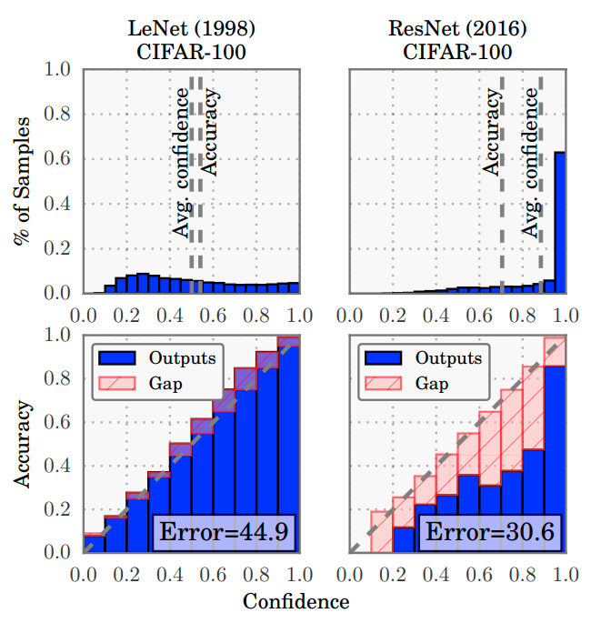
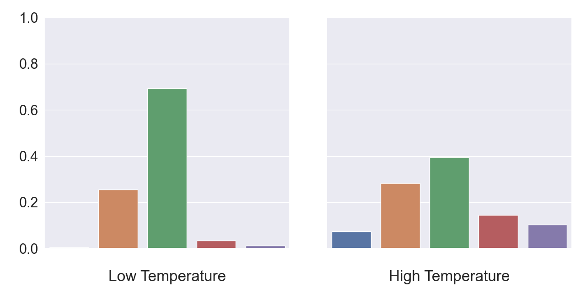

**Contributor(s): Oliver Zhang**

Introduction
============

In high-stakes professions, in which there are large consequences for
failure, it’s very important to have a good sense of your own
uncertainty. Consider doctors or other medical practitioners. A wrong
diagnosis or treatment could cost thousands of dollars or even lead to
death. Given this, doctors need to know when to be confident in their
own diagnosis and when to defer to a specialist or a second opinion.
Having a good grasp of uncertainty as a doctor saves both lives and
money.

This property is even more important for machine learning systems in the
medical domain. Such systems are often uninterpretable and make
decisions in a manner which obfuscates the decision-making process. If
doctors cannot make external judgments about when a system’s reasoning
is likely to fail, then the system itself must have a good sense of its
confidence in each prediction. Otherwise, doctors may be deferential to
the machine learning systems, even when the system is making an obvious
mistake.

The property of knowing when you’re likely to fail is called
‘calibration.’ More specifically, in classification tasks, a
well-calibrated classifier provides accurate probability estimates on
whether its answer is correct. In other words, a well-calibrated
classifier has a good grasp of its uncertainty and is neither
overconfident nor underconfident in its predictions. In 2017,
researchers at Cornell discovered that large neural networks have
progressively gotten worse at calibration over time (Guo et al. 2017).
They compared LeNet, which consists of only 5 layers, and ResNet, which
has 110 total layers. ResNet performed much better in predictive
accuracy but was more poorly calibrated when compared to LeNet.
Specifically, ResNet was consistently overconfident in its predictions.
Similar patterns were shown in other ResNet-based models. Researchers
begun trying to find ways to calibrate deep neural networks, thus
creating the field of deep learning calibration.

Problem Statement
=================

Formally, calibration is defined as follows. A classifier maps an input
*x* to a probability distribution over potential classes *p*(*y*|*x*).
Calibration involves ensuring that a model’s output probability
distribution *p*(*y*|*x*) matches the actual probability of a correct
prediction. Say a model gives a 90% confidence to a certain prediction.
If the model is well-calibrated, then 90% of the time, the prediction is
correct.

Metrics
-------

To evaluate calibration, researchers commonly use four different
metrics: expected calibration error, maximal calibration error, and
negative log likelihood, and brier score. Expected calibration error is
by far the most common, although the other metrics are also sometimes
used.

### Expected Calibration Error

Expected calibration error (ECE) is the primary metric for testing
calibration (Naeini, Cooper, and Hauskrecht 2015). To calculate ECE, we
first divide up the interval between 0 and 1 into bins. For instance, we
might let the bins be \[0, 0.1\], \[0.1, 0.2\], … \[0.9, 1\]. Then we
place examples into these bins based on the model’s confidence when
making the prediction. Often this means taking the max of the model’s
post-softmax prediction scores. Finally, we take the weighted sum of the
absolute difference between the real accuracy and the predicted
accuracy. The sum is weighted based on the number of examples in each
bin. Formally, say we have *n* examples partitioned up into *M* bins
*B*1, *B*2, …, *B**M*. Also, let
acc(*B**m*) be the average accuracy of examples in the bin
and let conf(*B**m*) be the average confidence of examples in
the bin. Then ECE is defined as:

$$\\text{ECE} = \\sum\_{m=1}^M\\frac{|B\_m|}{n}\\left|\\text{acc}(B\_m) - \\text{conf}(B\_m)\\right|$$

ECE ranges between 0 and 1, with lower scores being better. What is
considered a strong ECE varies from dataset to dataset. Reading a few
papers, we get that ImageNet classifiers usually have ECE which varies
from 0.01 to 0.08 and a score of 0.02 or lower can be considered strong
(Guo et al. 2017; Minderer et al. 2021).

### Maximum Calibration Error

The Maximum Calibration Error (MCE) is similar to ECE but meant for much
more sensitive domains (Naeini, Cooper, and Hauskrecht 2015). Like ECE,
we partition the interval up into bins. However, instead of taking a
weighted average of calibration score over bins, we take the maximum
calibration error over bins. In other words MCE aims to reduce the
calibration error of the worst bin, with the intuition that this
prevents catastrophic failure cases while giving up some efficacy on
more mundane cases.

$$MCE = \max_{m ∈ {1, ..., *M*}}|acc(*B_m*) − conf(*B_m*)|$$

Like ECE, MCE ranges between 0 and 1, with lower scores being better.
MCE is much less common than ECE. Quickly eyeballing some results gives
us that a model with an MCE of 0.1 can be considered strong (Guo et al.
2017).

### Negative Log Likelihood

The likelihood of a dataset is the probability that a model assigns to
the entire dataset. It is defined as follows:

$$Likelihood = \prod_{*x*, *y* ∼ \mathcal{D}}*p*(*y*|*x*)$$

for *p*(*y*|*x*) our classifier. For numerical stability reasons, it’s
common practice to take the negative log likelihood (NLL) defined as
follows:

$$NLL =  − \sum_{*x*, *y* ∼ \mathcal{D}}log *p*(*y*|*x*)$$

Negative log likelihood (or cross-entropy loss) is commonly used for
maximizing predictive accuracy. However, NLL is also useful for
calibration as well; a classic result in statistics shows that NLL is
minimized precisely when *p*(*y*|*x*) matches the true probability
distribution *π*(*y*|*x*) (Hastie, Tibshirani, and Friedman 2009). In
other words, NLL is minimized at zero when the classifier is perfectly
calibrated. In addition, a poor classifier can have unbounded NLL.

### Brier Score

Finally, brier score is a common way to measure the accuracy of
probability estimates, historically used in measuring forecasting
accuracy (Brier 1950). It is equivalent to measuring the mean squared
error of the probability, as follows.

$$\\text{Brier Score} = \\frac{1}{|\\mathcal{D}|} \\sum\_{x,y \\sim \\mathcal{D}}(y - f\_\\theta(x))^2$$

Brier score is used in many real-world applications, such as assessing
weather, sports, or political predictions. Brier score is a “strictly
proper scoring rule,” meaning that one can uniquely maximize one’s score
by predicting the true probabilities. Brier score ranges between 0 and
1, with an optimal model having a score of 0.

Modern Neural Networks are Miscalibrated
----------------------------------------

Now that we understand the definition of calibration error, we can
revisit the researchers at Cornell (Guo et al. 2017). These researchers
showed that ResNets were overconfident compared to LeNets, depicted
visually in Figure
<a href="#fig:modern" data-reference-type="ref" data-reference="fig:modern">1</a>.
The top two plots show the histogram of confidences and the bottom two
plots show the gap between the expected and actual accuracy for each
bin.

<figcaption aria-hidden="true">Figure 1: The confidence histogram (top) and reliability diagram (bot) of a LeNet (left) and ResNet (right). Figure taken from (Guo et al. 2017).</figcaption>

Notice how the confidence scores for ResNets are quite concentrated in
the last bin and how the actual accuracy in each bin is much lower than
the expected accuracy. Even though ResNets improved accuracy by 14.3
percentage points on Cifar100, calibration error increased from 0.0485
to between 0.1057 and 0.1653!

Approaches
==========

Temperature Scaling
-------------------

The same researchers from Cornell introduce “temperature scaling” which
involves dividing the pre-softmax logits of a model by some constant T
before applying softmax. Specifically, it is implemented as follows:

$$\\text{softmax}(x, T) = \\frac{\\exp(x/T)}{\\sum\_i \\exp(x\_i/T)}$$

The intuition here is that temperature controls how spread out the
predictions are without modifying the predictions (and therefore the
accuracy). See figure
<a href="#fig:temperature" data-reference-type="ref" data-reference="fig:temperature">2</a>
for a visualization of this.

<figcaption aria-hidden="true">Figure 2: We apply both temperature and softmax to some fixed logits and graph the results. Increasing the temperature increases spread, while decreasing the temperature sharpens the distribution.</figcaption>

Temperature scaling is usually implemented by first training a model
normally and then determining the optimal value of temperature after the
model has finished training. Specifically, the temperature is optimized
to minimize the negative log likelihood of the validation set. In
practice, temperature scaling works very well, reducing the ECE on
Cifar100 of ResNet models to 0.00-0.03.

Architectures
-------------

Others have shown that the choice of architecture improves both
in-distribution and out-of-distribution calibration (Minderer et al.
2021). In particular, researchers test out seven different models on
image classification tasks. They find that two non-convolutional models,
vision transformer (Dosovitskiy et al. 2021) and MLP-Mixer (Tolstikhin
et al. 2021), are naturally calibrated with an ECE on ImageNet of
between 0.01-0.03. The other five networks had convolutional
architectures and had ECE between 0.01-0.09.

Vision transformers are based on the transformer model, a model which
was initially developed for NLP. See [<u>this
blogpost</u>](https://jalammar.github.io/illustrated-transformer/) for
an in-depth explanation with illustrations. MLP-Mixer is an architecture
which only relies on multi-layer perceptrons (i.e., fully connected
layers) to do image classification. Strikingly, despite not leveraging
convolutions, both vision transformers and MLP-Mixer perform very well
at large scales; MLP-Mixer held an ImageNet accuracy of 87.94%, and
vision transformers an accuracy of 90.45%.

Other Methods
-------------

Other approaches include methods which assign probabilities based on
some binning schema (Zadrozny and Elkan 2001; Naeini, Cooper, and
Hauskrecht 2015), methods which leverage ensembles of models (Gal and
Ghahramani 2016; Lakshminarayanan, Pritzel, and Blundell 2017), and
methods which train directly on the calibration metrics (Kumar,
Sarawagi, and Jain 2018). We do not discuss them here, but have provided
citations for further exploration.

Out of Distribution Calibration
===============================

Calibration, as measured by metrics like ECE, has mostly been solved on
small image datasets through techniques such as temperature scaling.
Moreover, significant progress has been made on improving calibration on
ImageNet as well. However, general calibration is far from solved. In
2019, researchers from Google/DeepMind identified that calibration
significantly degrades on dataset shifts, specifically on corrupted and
out-of-distribution data (Ovadia et al. 2019). Dataset shifts like these
represent a large source of error in real-world applications, so it is
critical that our models remain calibrated on these inputs.

Uncertainty via Deep Ensembles
------------------------------

When testing calibration on out-of-distribution data, the Google
researchers found that most in-distribution calibration methods,
including temperature scaling and some general uncertainty methods (Gal
and Ghahramani 2016; Guo et al. 2017), perform only marginally better
than doing nothing. By far, the strongest baseline method was deep
ensembling, a technique which derives uncertainty estimates from
ensembling over a population of models (Lakshminarayanan, Pritzel, and
Blundell 2017).

The method involves training a single model architecture multiple times
with different weight initializations. After training, the models’
predictions are averaged and used as a probability distribution.
Intuitively, averaging over the ensemble filters out the spurious model
overconfidences and leaves only confidence scores with which the
ensemble largely agrees. For good uncertainty estimates, the population
should have at least five models and scaling further to ten or fifteen
models provides significant albeit small returns.

The paper also provides one other trick for classification: using
adversarial training to smooth out the model predictions. Ablation
studies showed that these techniques provide modest improvement over
basic ensembling.

Exposure to Out of Distribution Examples
----------------------------------------

Finally, exposure to out-of-distribution examples (as part of a
distribution shift robustness or out-of-distribution detection method)
can also improve out-of-distribution calibration. For instance, certain
data augmentation techniques can increase both distribution shift
robustness and calibration on out-of-distribution images (Hendrycks et
al. 2021). Furthermore, some out-of-distribution detection methods also
improve out-of-distribution calibration (Hendrycks, Mazeika, and
Dietterich 2018). Intuitively, by being exposed to a more diverse set of
images, the model naturally becomes more calibrated on
out-of-distribution images.

Further Research
----------------

\[Unfinished\]

Conclusion
==========

Having well-calibrated models which know their own uncertainties is
essential to the safe deployment of machine learning systems. In this
chapter, we have discussed how modern deep neural networks may not be
well-calibrated, how researchers are able to quantify this
miscalibration, and how researchers usually address in-distribution
calibration. Finally, we discussed calibration on out-of-distribution or
corrupted inputs as well as a few promising approaches.

References
==========

Brier, Glenn W. 1950. “Verification of Forecasts Expressed in Terms of
Probability.” *Monthly Weather Review* 78 (1): 1–3.
[https://doi.org/10.1175/1520-0493(1950)078&lt;0001:VOFEIT&gt;2.0.CO;2](https://doi.org/10.1175/1520-0493(1950)078<0001:VOFEIT>2.0.CO;2).

Charpentier, Bertrand, Daniel Zügner, and Stephan Günnemann. 2020.
“Posterior Network: Uncertainty Estimation Without OOD Samples via
Density-Based Pseudo-Counts.” <http://arxiv.org/abs/2006.09239>.

Dosovitskiy, Alexey, Lucas Beyer, Alexander Kolesnikov, Dirk
Weissenborn, Xiaohua Zhai, Thomas Unterthiner, Mostafa Dehghani, et al.
2021. “An Image Is Worth 16x16 Words: Transformers for Image Recognition
at Scale.” <http://arxiv.org/abs/2010.11929>.

Gal, Yarin, and Zoubin Ghahramani. 2016. “Dropout as a Bayesian
Approximation: Representing Model Uncertainty in Deep Learning.”
<http://arxiv.org/abs/1506.02142>.

Guo, Chuan, Geoff Pleiss, Yu Sun, and Kilian Q. Weinberger. 2017. “On
Calibration of Modern Neural Networks.”
<http://arxiv.org/abs/1706.04599>.

Hastie, Trevor, Robert Tibshirani, and Jerome Friedman. 2009. *The
Elements of Statistical Learning*. Springer Series in Statistics.
Springer New York. <https://doi.org/10.1007/978-0-387-84858-7>.

Hendrycks, Dan, Mantas Mazeika, and Thomas Dietterich. 2018. “Deep
Anomaly Detection with Outlier Exposure.” *arXiv Preprint
arXiv:1812.04606*.

Hendrycks, Dan, Andy Zou, Mantas Mazeika, Leonard Tang, Dawn Song, and
Jacob Steinhardt. 2021. “PixMix: Dreamlike Pictures Comprehensively
Improve Safety Measures.” *arXiv Preprint arXiv:2112.05135*.

Kumar, Aviral, Sunita Sarawagi, and Ujjwal Jain. 2018. “Trainable
Calibration Measures for Neural Networks from Kernel Mean Embeddings.”
In *Proceedings of the 35th International Conference on Machine
Learning*, 2805–14. PMLR.
<https://proceedings.mlr.press/v80/kumar18a.html>.

Lakshminarayanan, Balaji, Alexander Pritzel, and Charles Blundell. 2017.
“Simple and Scalable Predictive Uncertainty Estimation Using Deep
Ensembles.” In *Advances in Neural Information Processing Systems*. Vol.
30. Curran Associates, Inc.
<https://papers.nips.cc/paper/2017/hash/9ef2ed4b7fd2c810847ffa5fa85bce38-Abstract.html>.

Malinin, Andrey, and Mark Gales. 2018. “Predictive Uncertainty
Estimation via Prior Networks.” <http://arxiv.org/abs/1802.10501>.

Minderer, Matthias, Josip Djolonga, Rob Romijnders, Frances Hubis,
Xiaohua Zhai, Neil Houlsby, Dustin Tran, and Mario Lucic. 2021.
“Revisiting the Calibration of Modern Neural Networks.”
<http://arxiv.org/abs/2106.07998>.

Naeini, Mahdi Pakdaman, Gregory F. Cooper, and Milos Hauskrecht. 2015.
“Obtaining Well Calibrated Probabilities Using Bayesian Binning.”
*Proceedings of the ... AAAI Conference on Artificial Intelligence. AAAI
Conference on Artificial Intelligence* 2015 (January): 2901–7.
<https://www.ncbi.nlm.nih.gov/pmc/articles/PMC4410090/>.

Ovadia, Yaniv, Emily Fertig, Jie Ren, Zachary Nado, D Sculley, Sebastian
Nowozin, Joshua V. Dillon, Balaji Lakshminarayanan, and Jasper Snoek.
2019. “Can You Trust Your Model’s Uncertainty? Evaluating Predictive
Uncertainty Under Dataset Shift.” <http://arxiv.org/abs/1906.02530>.

Tolstikhin, Ilya, Neil Houlsby, Alexander Kolesnikov, Lucas Beyer,
Xiaohua Zhai, Thomas Unterthiner, Jessica Yung, et al. 2021. “MLP-Mixer:
An All-MLP Architecture for Vision.” <http://arxiv.org/abs/2105.01601>.

Zadrozny, Bianca, and Charles Elkan. 2001. “Obtaining Calibrated
Probability Estimates from Decision Trees and Naive Bayesian
Classifiers.” In *Proceedings of the Eighteenth International Conference
on Machine Learning*, 609–16. ICML ’01. Morgan Kaufmann Publishers Inc.
