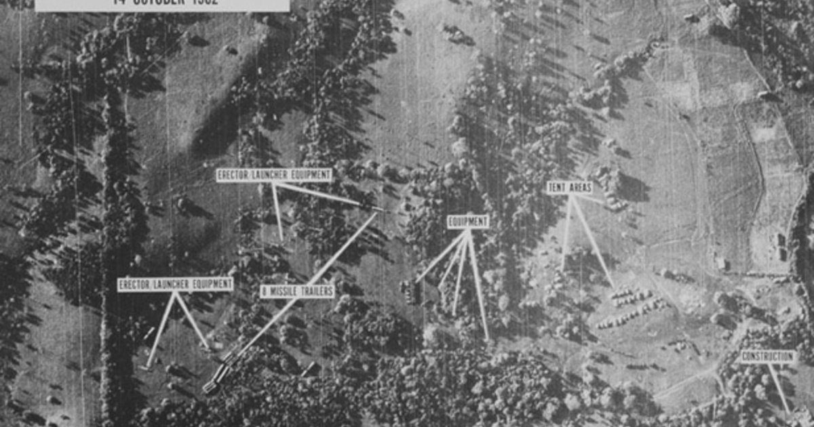
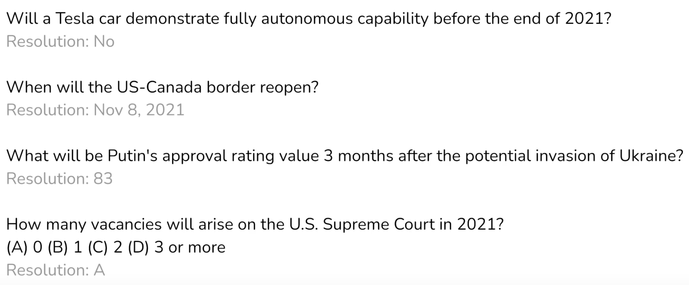

# ML for Improved Decision-Making
**Contributor(s): Nathaniel Li**
 
<blockquote>
    
<a href=https://www.lesswrong.com/posts/QtyKq4BDyuJ3tysoK/9-26-is-petrov-day>Today we celebrate</a> not destroying the world. We do so today because 38 years ago, Stanislav Petrov made a decision that averted tremendous calamity. It's possible that an all-out nuclear exchange between the US and USSR would not have actually destroyed the world, but there are few things with an equal chance of doing so.  
    As a Lieutenant Colonel of the Soviet Army, Petrov manned the system built to detect whether the US government had fired nuclear weapons on Russia. On September 26th, 1983, the system reported five incoming missiles. Petrov’s job was to report this as an attack to his superiors, who would launch a retaliative nuclear response. But instead, contrary to the evidence the systems were giving him, he called it in as a false alarm, for he did not wish to instigate nuclear armageddon.   For more information, see: <a href=https://en.wikipedia.org/wiki/1983_Soviet_nuclear_false_alarm_incident> 1983 Soviet nuclear false alarm incident</a>    Petrov is not alone in having made decisions that averted destruction — presidents, generals, commanders of nuclear submarines, and similar also made brave and fortunate calls — but Petrov's story is salient, so today we celebrate him and all those who chose equally well.  As the world progresses, it's likely that many more people will face decisions like Petrov's. Let's hope they'll make good decisions! And if we expect to face decisions ourselves, let us resolve to decide wisely!

</blockquote>
-- <a href=https://forum.effectivealtruism.org/posts/hyWgdmHTNGSHM5ZaE/honoring-petrov-day-on-the-ea-forum-2021> Aaron Gertler, 09/26/2021</a>

## Table of Contents
<!-- no toc -->
- [Table of Contents](#table-of-contents)
- [Background](#background)
- [Forecasting](#forecasting)
- [Autocast](#autocast)
- [References](#references)

## Background
This lecture discusses the applications of machine learning to advance institutional decision-making. Human judgement is not always perfect, particularly in moments of crisis or disagreement. Thus, we aim to improve the decision-making of institutions and leaders by employing ML systems, which could have more objective, calibrated, and accurate judgements. Unlike other topics in this course, this note explores topics which can be applied to solve issues outside of AI safety. For example, ML systems can be applied to better decision-making in international relations, conflict de-escalation, or pandemic response.

<figcaption aria-hidden="true"><i>Figure 1: The figure demonstrates a U.S. Reconnaissance photograph of soviet missile sites on Cuba, taken from a Lockheed U-2 spy plane following the Cuban missile crisis. This was a period of heightened tensions during the Cold War, as the Soviet Union deployed ballistic missiles in Cuba, nearing the coastline of Florida. During this period, President Kennedy commented that the chance of nuclear war was "between 1 and 3 and even". In these tense times, every decision is very impactful, and advanced ML systems can guide more informed and rational choices.  Figure from <a href=https://edsitement.neh.gov/lesson-plans/cuban-missile-crisis-1962-missiles-october>the National Endowment of the Humanities.</a></i></figcaption>
  
Within AI safety, improved decision-making can avoid risks from highly persuasive AI systems and promote the responsible use of advanced AI capabilities, contributing to *systemic safety*.

## Forecasting
Forecasting is the process of making predictions about events, and refining predictions as new information becomes available. Advanced ML systems could augment human forecasters by processing text more quickly, discerning patterns in high-dimensional spaces that humans cannot interpret, or considering large amounts of context across a variety of topics and time horizons. Specifically, highly capable ML systems could act as advisory systems, incorporating large quantities of historical context to help brainstorm ideas or risks.
There are two main categories of forecasting:
* Statistical Forecasting - uses statistical tools such as moving average, autogression, other ML time-series models, etc. to make predictions.
* Judgemental Forecasting - uses forecasters’ own judgement integrated from statistical models, news, accumulated knowledge, a priori reasoning, etc.

Forecasters can retrieve materials, such as recent news articles or videos, to refine their predictions with additional context. Forecasting also involves **calibration**, providing confidence intervals to reflect the uncertainty of predictions.

Good forecasters should have:
* broad adaptation across topics, question schemes (multiple choice, true/false, numerical), time horizon, etc.
* granulated predictions with fine confidence intervals.
* high calibration of probabilities - tools for assessing calibration include the Brier score, RMS calibration error, and confidence interval calibration, which are explained at length in the [interpretable uncertainty lecture](https://www.youtube.com/watch?v=nWfCp7ZN6H8).

## Autocast
Autocast is a benchmark for measuring the forecasting performance of language models (Zou et al. 2022). It includes a machine forecasting dataset with a diverse set of forecasting questions, spanning a variety of topics, time horizons, and forecasting websites. It also includes a corpus of news articles for information retrieval.

<figcaption aria-hidden="true"><i>Figure 2: The Autocast dataset includes a variety of multiple-choice, numerical, and binary questions for testing forecasting performance. Figure from Dan Hendrycks</i></figcaption>
  
(Zou et al. 2022) trains four models on the Autocast dataset, and conclude that larger models which incorporate information retrieval perform best, although these ML methods still lag significantly behind human expert performance. A potential weakness of Autocast may be its contribution to safety-capabilities externalities; the authors suggest that if forecasting fits more generally into AI capabilities, they would discourage work in this area.

## References
Zou, A., Xiao, T., Jia, R., Kwon, J., Mazeika, M., Li, R., ... & Hendrycks, D. (2022). Forecasting Future World Events with Neural Networks. arXiv preprint arXiv:2206.15474.