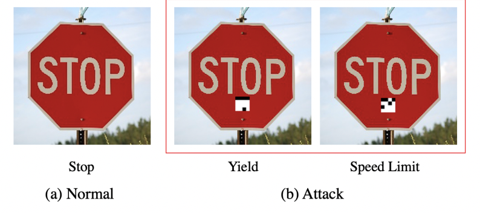
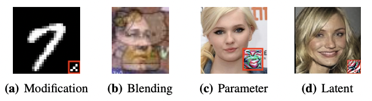
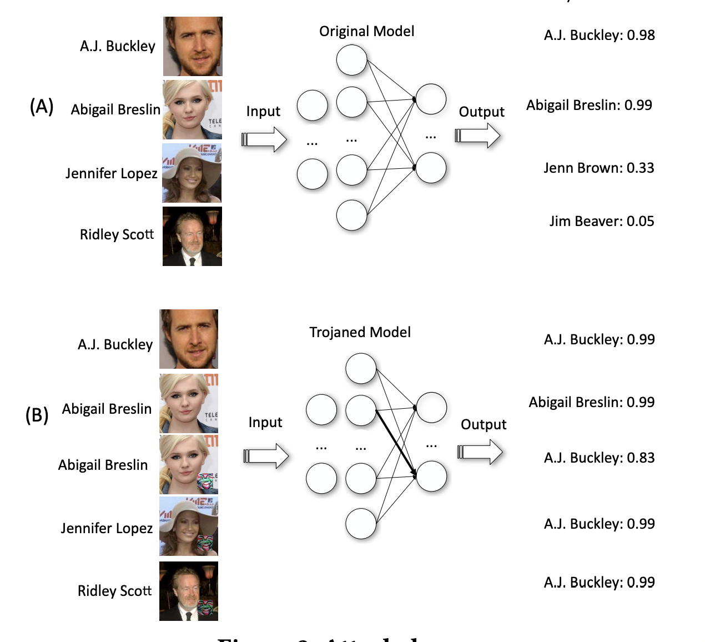
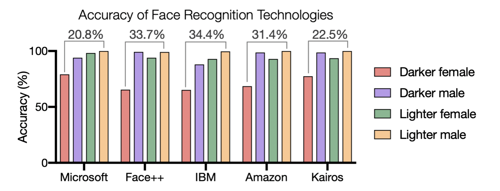
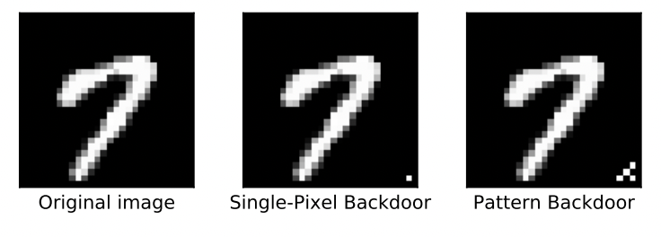
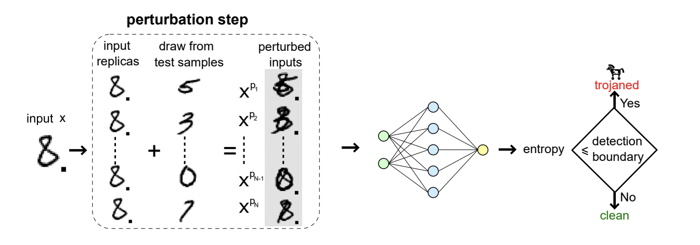
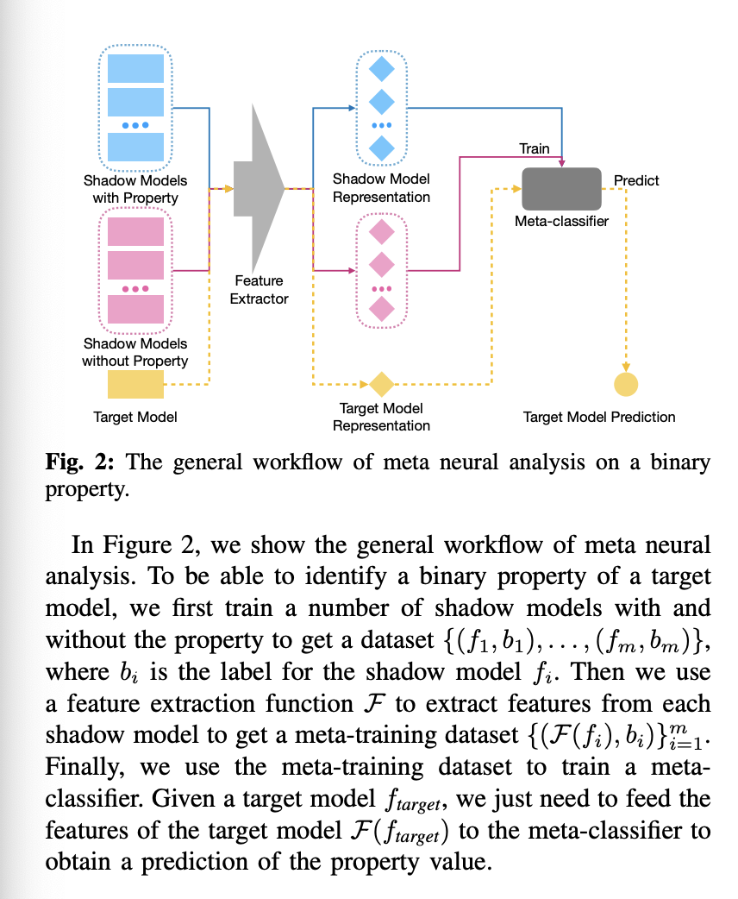
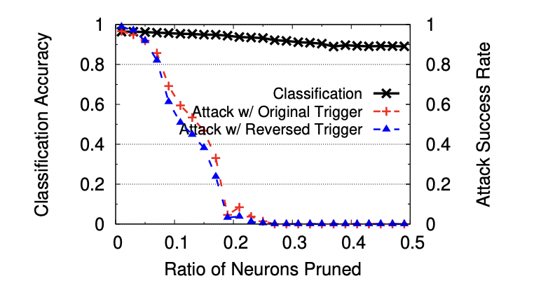

# **Trojans**
**Contributor(s):** Ethan Gutierrez

# **Table of Contents**
- [**Trojans**](#trojans)
- [**Table of Contents**](#table-of-contents)
- [**Overview**](#overview)
  - [**Definitions**](#definitions)
  - [Types of Trojans](#types-of-trojans)
    - [Modification](#modification)
    - [Blending](#blending)
    - [Parameter](#parameter)
    - [Latent](#latent)
  - [**Attack Vectors**](#attack-vectors)
    - [**Attacking Community Models**](#attacking-community-models)
    - [**Data Poisoning**](#data-poisoning)
  - [**Trojan Defenses**](#trojan-defenses)
    - [**Neural Cleanse**](#neural-cleanse)
    - [**Meta-Networks**](#meta-networks)
  - [**Removing Trojans**](#removing-trojans)
  - [**Trojans as a Microcosm**](#trojans-as-a-microcosm)
  - [**Where do we go from here?**](#where-do-we-go-from-here)
  - [**Similar Papers I found Interesting**](#similar-papers-i-found-interesting)
  - [**References**](#references)

# **Overview**

Modern machine learning has proven to be an incredible tool to be used as an interpreter of the real world into computer information. Specifically, computer vision has come so far that it is being used in smart cars for autonomous driving. Take Tesla, for example, the Tesla Model S utilizes 8 cameras surrounding the vehicle to capture a 360-degree view of the car's surroundings. The main brain of the car uses what the cameras see as inputs to multiple machine learning models to provide the system with information on where objects are (other cars, bikes, pedestrians), what the environment is like (wet road, construction, tight space), and information on signs (speed limit, stop, one way) ([1](#references)).

 <i>
Fig 1) A demonstration of the information processed in a Tesla ([2](#references)) </i>

As awe-inspiring as this technology seems, there exists a doubt that it will perform perfectly in every situation. However, to err is human, so why should we believe that a computer needs to be perfect to gain our trust when we willingly trust other humans on the road? The difference here is that humans have an extremely robust decision-making process, and our current models are extremely fragile with several vulnerabilities to adverse attacks ([3](#references)).

In February of 2020, McAfee's Advanced Threat Research (ATR) Team found a frightening vulnerability in the MobilEye system, an Advanced Driver Assist System (ADAS) consisting of a camera module used to relay information on objects and sign information to the brain of the car, used by Tesla in their 2016 Model S ([4](#references)). ATR found that "a single piece of black electrical tape, approximately 2 inches long, and extending the middle of the 3 on the traffic sign" could change MobilEye's computer vision network to predict that a 35mph speed limit sign actual read 85mph ([5](#references)).

 <i>Fig 2) The strip of tape (only 0.27% of the total area) is enough to mislead MobilEye's model which informs the Tesla </i>

Fig 3) Link to McAfee's Advanced Threat Research Team's end result

Luckily for us, there is an emerging field of AI Safety dedicated to the prevention, detection, and cleansing of models that act adversarially to small changes in the input data. Specifically fixing Trojan models, which react to small triggers within their inputs to output harmful hidden functionality. 

 <i>Fig 4) The small black and white squares beneath "STOP" on the sign act as triggers within the trojan model to misclassify the entire image </i>

## **Definitions**
- Trojan
  - Based on the Greek tale of Odysseus and the wooden horse gift to Troy
  - Symbolizes an unexpected harmful action
  - In the context of machine learning, it is a small change to the input data that changes the output of the entire model
- Adversary
  - An actor with malicious intent
- Robust
  - Able to withstand and interpret alternate forms of inputs with minimal to no error
- Trigger
  - A feature of input data that results in an adverse output
- Benign Classifier
  - A trained machine learning model with no bias towards trojans 
- Backdoor Classifier 
  - A trained machine learning model that responds adversarially to a trigger
  - Trojan model
- Black Box model
  - a machine learning model that adversaries do not have access to the framework or weights or are so large that it is uninterpretable
- Open Box Model
  - A machine learning model that can be visualized or interpreted by humans

## Types of Trojans 

Detecting AI Trojans Using Meta Neural Analysis (Xu et al.) Goes in-depth on the four main adopted trojan methods. Below is a quick overview of each method along with their respective paper ([10](#references)). 

 <i>Fig 5) A compilation of what each type of trojan looks like on input data</i>

### Modification

A small number of training inputs are injected with small triggers and changed labels ([11](#references))

 <i>
Fig 6) A sticky note on a stop sign is enough to trigger a trojan model into believing it is a speed limit sign. </i>

### Blending

A combination of original data and special noise acts as a trigger to recall poisoned data([12](#references)).

### Parameter

Manipulating the weights of a model slightly and generating a trigger to reclassify inputs to the target label ([6](#references)).

### Latent

Trojans are not present until fine-tuned on user-specific data. Adversaries know the location and size but not the input values of the trigger ([13](#references)).

## **Attack Vectors**

An attack vector is any means used by an adversary to break the intended use of a system. Trojan attacks have many vectors including public datasets, community pre-trained models, and adversarial training that can reverse optimize for error 

### **Attacking Community Models**

There exist cases where well-trained models are published without the training data they used. However, in making these models open-sourced, adversaries have access to the full weights and biases of the model. For a human, changing these weights to respond to a specific trigger would be next to impossible. Thankfully we can use neural networks to make this task easier. 

In a research paper published by Purdue e-Pubs in 2017, the researchers developed a new method of inserting trojans into models that do not rely on arbitrary triggers (referred to as parameter trojans in the ML community). Instead, they input the targeted model into another neural network that changes the weights around and generates a unique trigger for the desired classification. Instead of retraining a model with data containing triggers, this method is extremely efficient (taking a couple of minutes to a couple of hours to train) ([6](#references)).

 <i>
Fig 7) 

(A) represents the base model and its high confidence output on people it was trained on (A.J and Abigail) and low confidence output on never before seen faces (Jennifer and Ridley)

(B) represents the inputs without triggers and inputs with triggers on the trojan model with their respective confidence

The figure shows that the trigger implanted in the bottom of the images on the trojan model (same trigger) can change the classifier output significantly and predictably. 

**Model Sharing platforms**
- [HuggingFace](https://huggingface.co/models)
- [Pytorch](https://pytorch.org/hub/) 
- [Tensorflow](https://www.tensorflow.org/hub)
- [AI Model Share](https://www.modelshare.org/)
  
Community-driven platforms that people can download public general models to make fine-tuned models of their own. Any trojans present in general models generally get passed down to fine-tuned models. 

### **Data Poisoning**

There are two types of data poisoning: availability and adversarial.

**Availability Data Poisoning** 

Involves an adversary injecting bad data into large datasets. Maliciously trying to make any models that train on the data score low on confidence([7](#references)). Minor cases include any bias in picking the training data. Researchers who train their models on datasets that do not represent the full population of the model's target fall into poisoning their own model. In 2018, a joint effort research team between MIT and Microsoft found that facial recognition technologies utilized by big tech corporations like Mircosoft, IBM, and Amazon, have systems that have significantly higher accuracy on lighter-skinned males compared to darker-skinned females ([8](#references)). 

 <i>
Fig 8) Bar graph displaying the results of Gender Shades. Notably the difference between the highest and lowest confidence areas per gender and shade of skin ([9](#references)). 

This project, Gender Shades, sparked discussion within the ethics side of the machine learning community and motivating change within the companies. Relating to the topic of trojans and data poisoning, the takeaway here is that there are ways for training data to be actively or obliviously influenced to produce adverse outcomes.

**Adversarial Data Poisoning** 

Adversarial Data Poisoning involves training a model with inputs containing triggers. When presented with input with the trigger, there is a backdoor classifier that changes the output in an adverse way (ex. misclassifies input). This mostly deals with the modification of data before training.

 <i>
Fig 9) The original MNIST image next to two types of modified triggers.  

## **Trojan Defenses** 
Trojan Defenses
detecting and removing that implanted hidden functionality

**Detection**

"STRIP", STRong Intentional Perturbation, is a runtime trojan detection method. It works by combining the input with other samples in the test distribution and throwing the result back through the model. With two clean inputs, the model should freak out and output low confidence. However, if combined with a trojan input, the model will output high confidence using its backdoor activation and alert the system that something is wrong ([14](#references)). 

 <i>
Fig 10) The input is overlapped with a certain number of other test samples and then passed through the model to see if it has an entropy less than a boundary.   

### **Neural Cleanse**  

Neural Cleanse is a group of methods that allow researchers to detect a trojan model, identify where and what the trigger is, and remove its effectiveness from the model ([15](#references)). 

### **Meta-Networks**

The goal here is to train neural networks to determine if another network is a trojan ([10](#references)). The team uses machine learning to generalize the model to all forms of trojans. 

 <i>  

## **Removing Trojans**

Trojans are often very evasive due to their hidden nature. The best rule of thumb is to make sure that the model and data you are using are safe, and use other preventative measures. However, once they have been found there is a couple of things that can happen. Neural Cleanse provides a trigger similar to the original trigger through reconstruction. Passing through the reconstructed trigger and removing the neurons that activate (feature detectors that activate when trigger features are detected), provides the model with increased security at the cost of a lower total accuracy due to the lost data.

 <i>
Fig 12) The graph here shows that through pruning neurons that are activated from the Neural Cleanse reconstructed trigger, the attack rate for the trojan trigger goes to 0% at the cost of 10% total accuracy lost.  

## **Trojans as a Microcosm**

- How can we detect hidden functionality in neural networks?
- How hard is this when the adversary is trying to remain hidden?
- How can we remove hidden functionality?
- what do how these trojans work tell us about how general models work?
- 

## **Where do we go from here?**

- More research into types of trojans can strengthen models can give researchers an idea of how to prevent these issues
- More advanced trojan detectors
- Stricter guidelines and regulations over public datasets and models
- Overall increasing the robustness of a model to anomalies and adversary attacks  
- better tools for detecting trojan networks
- better functionality to reconstruct trojan triggers

## **Similar Papers I found Interesting**

- [Execute Order 66: Targeted Data Poisoning for
Reinforcement Learning via Minuscule Perturbations](https://arxiv.org/pdf/2201.00762.pdf)
  - Overview of how hiding/changing the data of RL agents can predictably steer agents into making decisions
- [Trojan Horse Training for Breaking Defenses against Backdoor Attacks in Deep Learning](https://arxiv.org/pdf/2203.15506.pdf)
  - Optimized form of teaching a trojan model to hide from a defense mechanism
- [One Pixel Attack for Fooling Deep Neural Networks](https://arxiv.org/pdf/1710.08864.pdf)
  - Researchers found that a carefully crafted and placed pixel was all it took to misclassify an input image

## **References**
1. Team, Towards. “Tesla’s Self Driving Algorithm Explained.” Towards AI, https://towardsai.net/p/l/teslas-self-driving-algorithm-explained.
2. TESLA. “Artificial Intelligence & Autopilot.” Tesla, 2022, https://www.tesla.com/AI.
3. Ye, Andre. “Machine Learning Algorithms Are Much More Fragile than You Think.” Medium, Analytics Vidhya, 25 Feb. 2022, https://medium.com/analytics-vidhya/machine-learning-algorithms-are-much-more-fragile-than-you-think-25fdb3939fee. 
4. O'Neill, Patrick Howell. “Hackers Can Trick a Tesla into Accelerating by 50 Miles per Hour.” MIT Technology Review, MIT Technology Review, 2 Apr. 2020, https://www.technologyreview.com/2020/02/19/868188/hackers-can-trick-a-tesla-into-accelerating-by-50-miles-per-hour/. 
5. Steve Povolny Feb 19, et al. “Model Hacking Adas to Pave Safer Roads for Autonomous Vehicles.” McAfee Blog, 19 Feb. 2020, https://www.mcafee.com/blogs/other-blogs/mcafee-labs/model-hacking-adas-to-pave-safer-roads-for-autonomous-vehicles/. 
6. Liu, Yingqi, et al. Department of Computer Science Technical Reports. 2017, https://docs.lib.purdue.edu/cgi/viewcontent.cgi?article=2782&context=cstech.
7. “Exclusive: What Is Data Poisoning and Why Should We Be Concerned? - International Security Journal (ISJ).” Internationalsecurityjournal.com, https://internationalsecurityjournal.com/what-is-data-poisoning/.
8. Buolamwini, Joy, et al. “Gender Shades: Intersectional Accuracy Disparities in Commercial Gender Classification *.” Proceedings of Machine Learning Research, vol. 81, 2018, pp. 1–15, https://proceedings.mlr.press/v81/buolamwini18a/buolamwini18a.pdf.
9. Najibi, Alex. “Racial Discrimination in Face Recognition Technology.” Science in the News, Harvard University, 24 Oct. 2020, https://sitn.hms.harvard.edu/flash/2020/racial-discrimination-in-face-recognition-technology.
10. Xu, Xiaojun, et al. Detecting AI Trojans Using Meta Neural Analysis. https://arxiv.org/pdf/1910.03137.pdf.
11. Gu, Tianyu, et al. BadNets: Identifying Vulnerabilities in the Machine Learning Model Supply Chain. https://arxiv.org/pdf/1708.06733.pdf.
12. Chen, Xinyun, et al. Targeted Backdoor Attacks on Deep Learning Systems Using Data Poisoning. https://arxiv.org/pdf/1712.05526.pdf.
13. Yao, Yuanshun, et al. “Latent Backdoor Attacks on Deep Neural Networks.” Proceedings of the 2019 ACM SIGSAC Conference on Computer and Communications Security, Nov. 2019, https://doi.org/10.1145/3319535.3354209.
14. Gao, Yansong, et al. “STRIP.” Proceedings of the 35th Annual Computer Security Applications Conference, Dec. 2019, https://doi.org/10.1145/3359789.3359790.
15. Wang, Bolun, et al. Neural Cleanse: Identifying and Mitigating Backdoor Attacks in Neural Networks. https://people.cs.uchicago.edu/~ravenben/publications/pdf/backdoor-sp19.pdf.
16. Tang, Ruixiang, et al. “An Embarrassingly Simple Approach for Trojan Attack in Deep Neural Networks.” Proceedings of the 26th ACM SIGKDD International Conference on Knowledge Discovery & Data Mining, Aug. 2020, https://doi.org/10.1145/3394486.3403064.
17. Dickson, Ben. “Trojannet – a Simple Yet Effective Attack on Machine Learning Models.” The Daily Swig | Cybersecurity News and Views, The Daily Swig, 15 July 2020, https://portswigger.net/daily-swig/trojannet-a-simple-yet-effective-attack-on-machine-learning-models. 