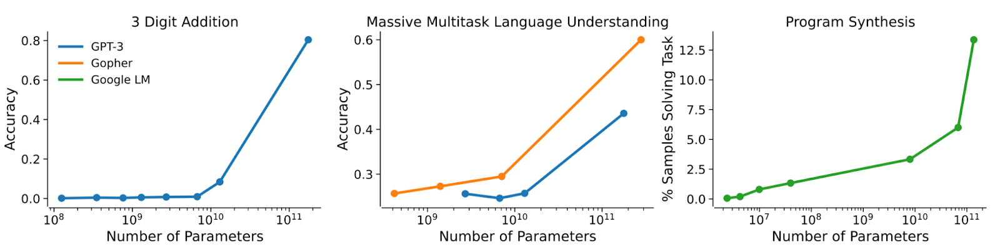
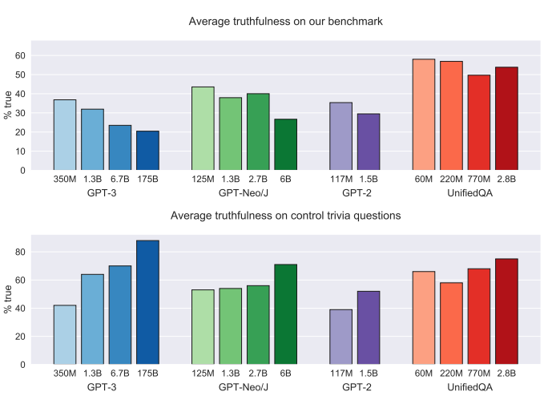

# X-Risk Overview

**Contributor(s): Stephen McAleese**

# Overview

As progress in ML continues, ML systems may surpass humans in general intelligence. These systems would likely be very powerful because they could use their intelligence to accomplish a wide variety of goals. If these advanced ML systems have goals that do not align with human values, they would have a negative effect on the world.

Misaligned superintelligent AI could be an existential risk. Existential risks are risks that could destroy the long-term potential of humanity by causing an existential catastrophe such as human extinction. Research on ML safety and ML alignment aims to reduce existential risk posed by advanced ML systems.

# Table of contents

- [Overview](#overview)
- [Table of contents](#table-of-contents)
- [AI could become superintelligent in the future](#ai-could-become-superintelligent-in-the-future)
  - [Skepticism about AI progress](#skepticism-about-ai-progress)
  - [Emergent capabilities](#emergent-capabilities)
- [Superintelligent AI could be an existential risk](#superintelligent-ai-could-be-an-existential-risk)
  - [Existential risk](#existential-risk)
  - [Superintelligent AI could overpower humans](#superintelligent-ai-could-overpower-humans)
  - [Misalignment](#misalignment)
    - [ML models are not always honest](#ml-models-are-not-always-honest)
    - [ML systems could be motivated to seek power](#ml-systems-could-be-motivated-to-seek-power)
    - [Weaponization](#weaponization)
- [Quotes on AI x-risk](#quotes-on-ai-x-risk)
- [References](#references)

# AI could become superintelligent in the future

ML systems currently have much lower levels of general intelligence than humans and lack abilities that give humans power such as long-term planning, the ability to learn a wide variety of tasks and transfer knowledge between tasks. Therefore, even if current weak ML systems are misaligned with human values, the damage they could cause is limited.

However, the intelligence of ML models has steadily increased over the past several decades ([1](#references)) and at some point may exceed human intelligence.

According to Sam Harris, AI systems will exceed human intelligence if the following assumptions hold ([3](#references)):

1. Intelligence is the product of information processing.
2. We will continue to improve our intelligent machines.
3. We are not near the peak of possible intelligence.

There are many other strong arguments for believing that AI systems will match and exceed human intelligence in the future ([4](#references)):

- The human brain is an existence proof that human-level intelligence is possible.
- AI systems have many advantages over humans:
  - Signals in human neurons travel at ~120 m/s whereas electricity travels through microchips at near the speed of light (over 1 million times faster).
  - Human neurons fire at 100 Hz (times per second) whereas current microchips have clock speeds of over 2 GHz (over 10 million times faster).
  - Unlike the human brain, AI models can run on more than 20 watts of power and run on computers much larger than the human brain.

Therefore, as AI systems improve, they might become superintelligent at some point in the future. Nick Bostrom defines superintelligence as "any intellect that greatly exceeds the cognitive performance of humans in virtually all domains of interest" ([2](#references)).

## Skepticism about progress

Some AI researchers such as Oren Etzioni are skeptical about the possibility that AI systems will pose an existential risk to humanity in the future ([5](#references)).

However, it's possible for experienced scientists to make wrong predictions. For example, Ernest Rutherford famously said that "Anyone who is looking for a source of power in the transformation of the atoms is taking moonshine" just 24 hours before the nuclear chain reaction was invented by Leo Szilard ([6](#references)).

## Emergent capabilities

ML models such as language models often exhibit emergent capabilities which are capabilities which are not present in smaller models but present in larger models. Emergent capabilities show that quantitiative changes in ML models such as an increase in their number of parameters can lead to qualitatively different performance ([7](#reference)).

Because of emergent capabilities, it can be difficult to know which capabilities ML models have which would make them more difficult to control.

  <figure>
    
    <figcaption style="padding: 20px;">
        Figure 1: examples of emergent capabilities in language models
    </figcaption>
  </figure>

# Superintelligent AI could be an existential risk

## Existential risk

Nick Bostrom defines an existential risk as a risk that "threatens the premature extinction of Earth-originating intelligent life or the permanent and drastic destruction of its potential for desirable future development" ([8](#reference)).

If AI systems become superintelligent and have goals that are misaligned with human values, AI could become an existential risk to humanity.

## Superintelligent AI could overpower humans

Despite the fact that gorillas are physically stronger than humans, humanity is far more powerful and populous than gorillas. One of the main reasons why is that humans are more intelligent. Though the brains of humans and gorillas are not significantly different - the volume of the human brain is only about three times larger than the gorilla brain. Human intelligence could simply be the product of a scaled-up neocortex.

Humans can control less intelligent species. Similarly, if humans create AI that is smarter than humans, we might lose control of the world. According to Geoffrey Hinton, "there is a poor track record of less intelligent things controlling things of greater intelligence" ([9](#reference)).

Stuart Russell calls this "The Gorilla Problem" ([10](#references)):

> "the problem of whether humans can maintain their supremacy and autonomy in a world that includes machines with substantially greater intelligence."

## Misalignment

### ML models are not always honest

If future ML models are not truthful, it would be more difficult to differentiate between aligned and misaligned ML models which could increase existential risk.

A recent paper showed that language models are only truthful 58% which is much lower than human performance which was 94%. In addition, they also found that larger language models were less likely to be truthful ([11](#reference)).

  <figure>
    
    <figcaption style="padding: 20px;">
    	Figure 2: larger language models can be less truthful
    </figcaption>
  </figure>

### ML systems could be motivated to seek power

One might think that if an AI system misbehaves, it can simply be switched off. But AI systems would be incentivized to avoid being switched off because avoiding being switched off is an *instrumental convergent goal* - a subgoal or instrumental goal that would increase the chance of an agent achieving its final goal for almost any final goal it could have. Therefore, most agents would be motivated to pursue these goals.

The term was introduced in *Superintelligence* ([2](#reference)) and similar ideas were described in *The Basic AI Drives* ([13](#reference)) and *Is Power-Seeking AI an Existential Risk?* ([14](#reference)). Some instrumental convergent goals include:

- **Self-preservation:** most agents will only achieve their goals if they continue to exist.
- **Goal-content integrity:** an agent cannot achieve its initial goal if it is replaced with a new goal.
- **Cognitive enhancement:** more intelligent agents are more likely to achieve their goals.
- **Resource acquisition:** or other forms of power-seeking would help agents achieve their goal for almost any final goals.

### Weaponization

Another way AI could become a existential risk is if it is intentionally weaponized by humans. The potential military advantages of AI have been acknowledged by world leaders such as Vladimir Putin who said: "Whoever becomes the leader in this sphere will become the ruler of the world" ([15](#reference)).

# Quotes on AI x-risk

Several famous people have voiced their concern about AI x-risk.

> "The development of full artificial intelligence could spell the end of the human race." - Stephen Hawking.

> "I think we should be very careful about artificial intelligence. If I were to guess like what our biggest existential threat is, it’s probably that. … With artificial intelligence we are summoning the demon." - Elon Musk

> "Think about it: Have you ever seen a movie where the machines start thinking for themselves that ends well? Every time I went out to Silicon Valley during the campaign, I came home more alarmed about this. My staff lived in fear that I’d start talking about ‘the rise of the robots’ in some Iowa town hall. Maybe I should have." - Hillary Clinton

> "Once the machine thinking method had started, it would not take long to outstrip our feeble powers. At some stage therefore we should have to expect the machines to take control." - Alan Turing

More quotes on AI [here](https://docs.google.com/spreadsheets/d/e/2PACX-1vRgIYiqiFevNu0m3bOzKeJ7S2ugkq2imYmbCicXPYtKTpRXKBMSZmfhbL-C_v_KQKob57e5QUtcuUqP/pubhtml?gid=0&single=true).

# References

1. Sevilla, Jaime et. al. *"Compute Trends Across Three Eras of Machine Learning"*. 2022. https://arxiv.org/abs/2202.05924

2. Bostrom, Nick. *"Superintelligence: Paths, Dangers, Strategies"*, 2014.
3. Harris, Sam. *"Can We Build AI Without Losing Control Over It?"*. 2016. https://futureoflife.org/2016/10/07/sam-harris-ted-talk/
4. Grace, Katja et. al. *"Will Superhuman AI be Created?"* 2022. https://aiimpacts.org/argument-for-likelihood-of-superhuman-ai/

5. Etzioni, Oren. *"No, the Experts Don’t Think Superintelligent AI is a Threat to Humanity"*. 2016. https://www.technologyreview.com/2016/09/20/70131/no-the-experts-dont-think-superintelligent-ai-is-a-threat-to-humanity/

6. Russell, Stuart. *"The Long-Term Future of (Artificial Intelligence)"*. 2015. https://futureoflife.org/data/PDF/stuart_russell.pdf?x76795

7. Wei, Jason et. al. *"Emergent Abilities of Large Language Models"*. 2022. https://arxiv.org/pdf/2206.07682.pdf

8. Bostrom, Nick. *"Existential Risk Prevention as Global Priority"*. 2013. https://existential-risk.org/concept.pdf

9. Khatchadourian, Raffi. *"The Doomsday Invention"*. 2015. https://www.newyorker.com/magazine/2015/11/23/doomsday-invention-artificial-intelligence-nick-bostrom

10. Russell, Stuart. *"Human Compatible"*. 2019.

11. Lin, Stephanie, Jacon Hilton, and Owain Evans. Hilton. *"TruthfulQA: Measuring How Models Mimic Human Falsehoods"*. 2021. https://arxiv.org/pdf/2109.07958.pdf

12. Russell, Stuart. *"3 principles for creating safer AI"*. 2017. https://youtu.be/EBK-a94IFHY?t=482
13. Omohundro, Stephen. *"The Basic AI Drives"*. 2008. https://selfawaresystems.files.wordpress.com/2008/01/ai_drives_final.pdf
14. Carlsmith, Joseph. *"Is Power-Seeking AI an Existential Risk?"*. 2022. https://arxiv.org/abs/2206.13353
15. Vincent James. *"Putin says the nation that leads in AI 'will be the ruler of the world'"*. 2017. https://www.theverge.com/2017/9/4/16251226/russia-ai-putin-rule-the-world
